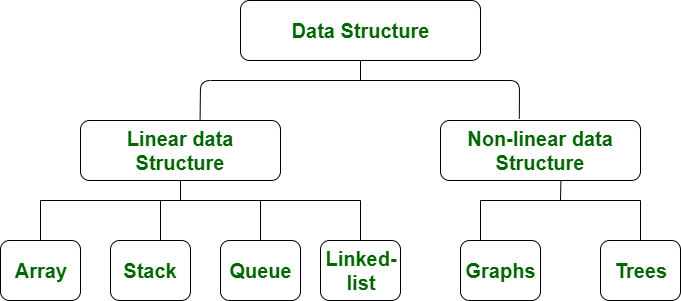
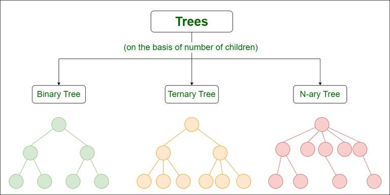
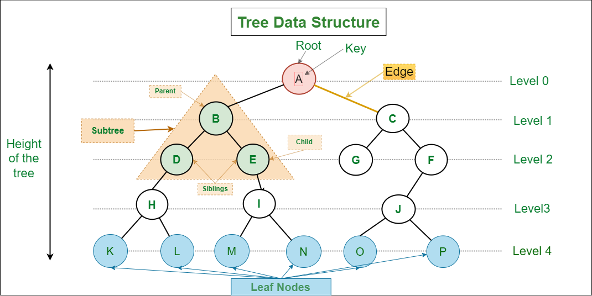

A "Tree" is a Non-Linear data structure. But, what does "NON-LINEAR" mean?

Well, there are two types of data structures - 

    1. Linear Data Structures
    2. Non-Linear Data Structures

## LINEAR DATA STRUCTURE

We call any data structure as "LINEAR" if the data elements are arranged sequentially or linearly where each and every element in attached to the previous and next one. In a linear data structure, there is a "Single Level". And hence, in a Linear Data Structure, we can traverse the entire elements in a single run. They are easy to implement because the computer memory is arranged in a linear way as well.

They are commonly used in application software development and are useful for simple data storage and manipulation.

Some of the most common linear data structures are - 

    1. Array
    2. Stack
    3. Queue
    4. Linked List
   
## NON-LINEAR DATA STRUCTURE

A data structure where the data elements are not arranged sequentially or linearly, is called a Non-Linear Data Structure. There is not just a single level in Non-Linear Data Structures. And so, it is not possible to traverse all the elements in a single run. They are also not easy to implement as compared to linear data structures.

But, the advantage is that the memory usage is more efficient than the Linear Data Structures.

They are commonly used in Artificial Intelligence, Image Processing etc. 

They are used to represent complex relationships and data hierarchies, for example social networks, file systems, computer networks etc. That's why they are also called "Hierarchical" Data Structures.

The examples are - 

    1. Trees
    2. Graphs
   
# WHAT IS A TREE DATA STRUCTURE?

A Tree is a hierarchical data structure used to represent and organize data in a way that is easy to navigate and search. It is a collection of nodes that are connected by edges and has a hierarchical relationship between the nodes. 

Trees are categorized into three types based on the maximum number of childran that each node can have.

The most common ones are "Binary Trees" where each node can have a maxmimum of 2 children linked to it. There are further classifications of the Binary Trees as well.

Then we have "Ternary Trees" where a node can have at most 3 children linked to it. These children are normally called "left", "mid" and "right".

Finally, we have the N-ary Trees or "Generic" Trees that are collection of nodes where each node is a data structure that consists of records and a list of references to its children(duplicate references are not allowed). Unlike the linked list, each node stores the address of multiple nodes.

# BASIC TERMINOLOGIES IN A TREE DATA STRUCTURE

**1. ROOT NODE** -> The topmost node of a tree or the node which does not have any parent node is called the root node.  {A} is the root node in above image.

**2. Parent Node**: The node which is a predecessor of a node is called the parent node of that node. {B} is the parent node of {D, E} in the above image.

**3. Child Node**: The node which is the immediate successor of a node is called the child node of that node. Examples: {D, E} are the child nodes of {B} in the above image.

**4. Leaf Node or External Node**: The nodes which do not have any child nodes are called leaf nodes. {K, L, M, N, O, P, G} are the leaf nodes of the tree in above image.

**5. Subtree**: Any node of the tree along with its descendant.

**6. Ancestor of a Node**: Any predecessor nodes on the path of the root to that node are called Ancestors of that node. {A,B} are the ancestor nodes of the node {E}. An easy way to understand it is like this - For node {E}, its parent is {B}. And for node {B}, its parent is {A}. So if we talk in real-world manner, the node {A} is the grandparent for the node {E}. 

And both the parent and grandparent and grand grand parent and so on.... are all the ancestors of the node {E}.

