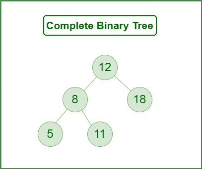
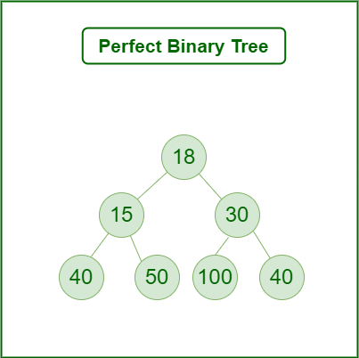

A binary tree is a tree data structure in which each node can have at most two children, which are referred to as the left child and the right child. 

The topmost node in a binary tree is called the root, and the bottom-most nodes are called leaves. A binary tree can be visualized as a hierarchical structure with the root at the top and the leaves at the bottom.

Since the number of children for each node are not fixed (a node can have 0,1 or 2 children), there are different types of Binary Trees, based on the number of children.

# **1. FULL BINARY TREE**

A Binary Tree is a full binary tree if every node has 0 or 2 children. We can also say a full binary tree is a binary tree in which all nodes except leaf nodes have two children. 

# **2. COMPLETE BINARY TREE**

A Binary Tree is a Complete Binary Tree if all the levels are completely filled except possibly the last level and the last level has all keys as left as possible.

It is just like a full binary tree but with a couple of differenes - 

 - Every level except the last level must be completely filled.
 - All the leaf elements must lean towards the left.
 - The last leaf element might not have a right sibling i.e. a complete binary tree doesn’t have to be a full binary tree.
  
# **3. PERFECT BINARY TREE**

A Perfect Binary Tree is the one where all the leaf nodes are at the same level and all the internal nodes have two children.

In a Perfect Binary Tree, the number of leaf nodes is the number of internal nodes plus 1. For example, we can see in above image that the nodes {18}, {15} and {30} are all internal nodes. And all have two children.

And so, total number of leaf nodes = 3 + 1 => 4

# **4. BALANCED BINARY TREE**

In a balanced binary tree, the height can be at most "Log N" where "N" is the number of nodes.

For example, if we are given a tree with number of nodes (N) = 8

Then, "Log N" is "3".

So, any tree with "8" nodes that has a height <= 3 is a Balanced Binary Tree.

This is also called a "HEIGHT-BALANCED" binary tree. In this tree, the height of the left and right subtree of any node differ by not more than "1".

In the image above, the second tree is not Balanced because we can see that the root node has a left subtree (starting from node 1) and a right subtree (starting from node 2). But, the left subtree has a height of 2 whereas the right subtree has a height of 0 and so the difference is "2" which is more than "1".

# **5. DEGENRATE BINARY TREE**

A Tree where each internal node has one child. These trees are same as linked-list in terms of the performance. Also known as "PATHOLOGICAL TREES".

# **6. SKEWED BINARY TREE**

This is at type of Degenerate Tree where the tree is either dominated by the left nodes or the right nodes. Thus, there are two types of skewed binary tree: left-skewed binary tree and right-skewed binary tree.

