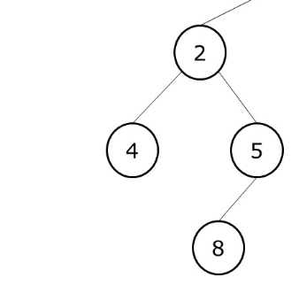

In Depth First Search (DFS), we start with the root node and then traverse the tree in depth while we find the node with no children and then backtrack it. 

A "STACK" is used to implemente Depth First Search.

As we can see in the image above, we started from the node {0}, then went to node {1} and then to node {3}. Now, we are at the lowest level and we see that there is no child for the node {3}. From here, we backtrack and go back to the parent of {3}, which is the node {1}.

And from there, we go to the right node of {1}, which is node {4}.

And this goes on till we reach the last node {6}.

Now, this is just one of the tree ways to do DFS. We could've traversed this tree in some other order as well. In this case, for each subtree, we first went to the left node, then to the root, and then to the right node. 

# TYPES OF DEPTH FIRST SEARCH TECHNIQUES

## 1. IN-ORDER TRAVERSAL (LEFT-ROOT-RIGHT)

In the In-order traversal, we first traverse the left subtree, then we visit the root, and then the right subtree. And we do this for each subtree inside subtree and so on.

So, the algorithm is like this - 

    - Traverse the left subtree
    - Visit the root.
    - Traverse the right subtree
  
In the above image, we can see the In-Order traversal in action.

The root node is {1} and its left subtree has root node {2} and right subtree has root node {3}.

The image above shows the left subtree. Now, we traverse it using the same algorithm as above.

This subtree has a root node {2} and two subtrees, the left tree having a single root node {4} and the right subtree having a root node {5} which further has a left node {8}
 
So again, we traverse the left subtree first, which is the one with node {4}. 

We traverse in this order - LEFT -> ROOT -> RIGHT

There is no "left" node for {4} so we first get the root node which is {4}. It does not have any right node as well so we are done with this subtree.

Now, we come back to the root which is {2}. And we are done.

And then we traverse the right subtree. And in this way, we back track till we traverse the entire tree.

And so, the result of Inorder Traversal is this - 

    4,2,8,5,1,6,3,9,7,10

## 2. PRE-ORDER TRAVERSAL (ROOT-LEFT-RIGHT)

In Pre-Order Traversal, we first get the "root" node's data, and then we move to the left and right subtree.

So, the algorithm is like - 

    - Visit the root.
    - Traverse the left subtree
    - Traverse the right subtree
  

If we take the same example as before, this time, we will first visit the root node which is {1}, then we will traverse the left subtree and right subtree.

So, the left subtree has root node {2} so we print it (or save it).

Then, we go to the left subtree starting at {4}, and then to the right subtree starting at {5}.

In this way, the Pre-Order traversal will give us - 

    1,2,4,5,8,3,6,7,9,10

## 3. POST-ORDER TRAVERSAL (LEFT-RIGHT-ROOT)

The final type of DFS is "POST-ORDER TRAVERSAL". In this one, we first traverse the "left" subtree, then the "right" subtree and finally the "root" node.

So, the algorithm is -

    - Traverse the left subtree
    - Traverse the right subtree
    - Visit the root
  

So, in the example shown in image above, the left subtree starts with a root node {2} but since it is post-order traversal, we will come to this root node at the end.

We first go to left subtree and get the value "4".

Then, we traverse the right subtree. The right subtree has root node {5} and left node is {8}. 

So, we go in the same order as - LEFT -> RIGHT -> ROOT

So, we first get the value "8" and then the value "5". And finally, we get the value "2"

Hence, finally, after we are done with Pre-order traversal, this is how the result looks like - 

    4,8,5,2,6,9,10,7,3,1