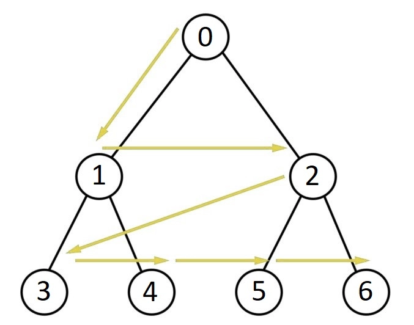

This is also known as "Level Order Traversal".

In this algorithm, we start from the root node and then visit all the nodes level by level from left to right. Here we see every node on a level before going to a lower level.

To implement BFS, we use a "QUEUE" data structure. 

If we take the above image, then this is how we traverse the tree -

    0 1 2 3 4 5 6

So, we go level by level.