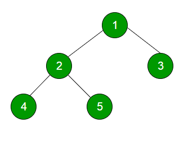
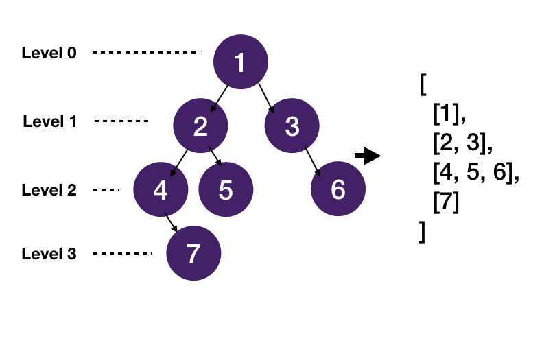
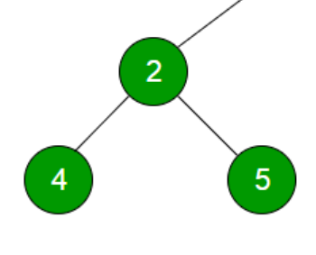
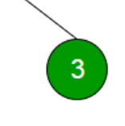

Level Order Traversal technique is defined as a method to traverse a Tree such that all nodes present in the same level are traversed completely before traversing the next level.

For the above example, this will be the output of the Level Order Traversal - 

    1 -> FIRST LEVEL
    2 3 -> SECOND LEVEL
    4 5 -> THIRD LEVEL

# LEVEL ORDER TRAVERSAL - NAIVE APPROACH

So, just by going over some examples, we can understand that in BFS or Level Order Traversal, we have to level by level and then get all the nodes in the current level.

It means, one thing that we need to know beforehand is how many levels the tree has. Or in other words, what is the height of the tree.

The Height of the tree is the distance from the root node to the farthest leaf node.

Take the above image as example. The root node is {1} and the height of the tree is "3" because that's the distance between root node {1} and the farthest leaf node {7}.

Note that it depends on you how you decide to find height of a tree. In some places, you will find that the height of a tree is calculated by counting the number of edges from root node to the farthest leaf node in the tree. If you do it this way, it means a tree with one node has a height of 0.

In some places, the height is calculated by counting the number of nodes between the root and the farthest leaf node (both included) and so, in this way, it means a tree with one node has a height of 1.

At the end of the day, you an use any approach in the code.

# HEIGHT OF THE TREE

Let's take the above example to understand that.

We will use recursion to get the height.

We can see that if we take the left subtree, then its height is "2" (we are counting nodes here so node {2} and node {4} = height of 2)
and if we take the right subtree, its height is "1"

This means, from the root node {1}, the farthest node in left subtree is at a distance of 2 + 1 => 3

And the farthest node in right subtree is at a distance of 1 + 1 => 2

And since 3 > 2, it means the height of the tree is "3" because as we understood above, height means the distance between the root and the farthest leaf node.

So, the algorithm for height of a tree is like this - 

    1. Get the height of left subtree (Recursive call)
    2. Get the height of right subtree (Recursive call)
    3. Get the (maximum of the two + 1) as the height from root

The code is like this - 

    def height(self, root):
        
        # Base Case
        if not root: return 0
        
        # Height of Left Subtree
        leftHeight = self.height(root.left)
        
        # Height of Right Subtree
        rightHeight = self.height(root.right)
        
        # Return the (maximum of two values + 1)
        return max(leftHeight, rightHeight) + 1

Now that we have height or number of levels in the tree, we can go over each level and then get all the nodes at that level.

# THE FINAL LOGIC

Since this is a Tree, it means we cannot directly jump to a specific level and then get all the nodes from that level. We have to traverse the whole tree from first level (or 0th level) to that particular level from which we can then get the nodes at that level.

So, we will go over each level, and call a recursive function that does all this printing of values in the nodes from a certain level - 
    def LevelOrder(root):
        h = self.height(root)
        for i in range(h):
            self.getNodesByLevel(root, i)

And finally, we have the function "getNodesByLevel" which takes the root node of a tree and the level from which we want to get all the nodes.

    def getNodesByLevel(root , level):

        # Base Case
        if root is None: return

        # If level is 0, print root node's value
        if level == 0: print(root.val)

        # Otherwise, make recursive calls for left and right subtrees
        else :
            getNodesByLevel(root.left , level-1)
            getNodesByLevel(root.right , level-1)

The above function is the most important function in this whole recursive approach because this is the one that will fetch all the nodes in current level.

It might be confusing at first, but let's break it down and understand how it works.

Take the above image as the example.

So, we first get the height of this tree which is "3". 

Now, this three has three levels so we will go over each of them one by one. That is, Level 0, Level 1, Level 2 (0-based indexing).

So first, the call made will be - 

    getNodesByLevel(root , 0)

That is, get all the nodes at level 0 of the tree with "root" node as the root.

And as per our code, the function will simply print the value at root node. Because at level 0, we have only one node and that is the root node.

Now, we call -

    getNodesByLevel(root, 1)

So, it means get all the nodes at level 1 of the tree.

Our code now goes into this block - 

    else :
        getNodesByLevel(root.left , level-1)
        getNodesByLevel(root.right , level-1)

That's because the level is "1" so we cannot print anything yet. We are still at level "0" at this point. Hence, we now make a recursive call to get the nodes at the "level-1" level for the left subtree and right subtree.

So, the calls made will be - 

        getNodesByLevel(root.left, 0)
        getNodesByLevel(root.right, 0)

The above image shows the "root.left" subtree that is passed to the first call.

So, the function is called again and this time, since the level is 0, it prints the root of this tree which is "2".

Similarly, the imag above shows the "root.right" subtree that is passed to second call.

So, the function is called again and this time, since the level is 0, it prints the root of this tree which is "3".

And the function ends.

The next call that is made is - 

    getNodesByLevel(root, 2)

That is, get all the nodes at level 2. 

So, the same thing happens and the function makes recursive calls until the "level" value passed to it changes to 0 which means we finally reached level 2 so at that point, we can print the root node's value for that particular subtree.

And so finally, the result we get is - 

    1 2 3 4 5

# THE PROBLEM WITH THIS APPROACH

The issue with approach is that it is not efficient. As we can see via the code, to get the nodes at a level "x", we have to traverse each level from 0 to "x". And we do this the same number of times as the number of levels.

If you think a bit, then in case of a left or right skewed tree, the overall time complexity will be O(N^2) which is also the worst case time complexity of this approach.

So, can we do better? YES!

