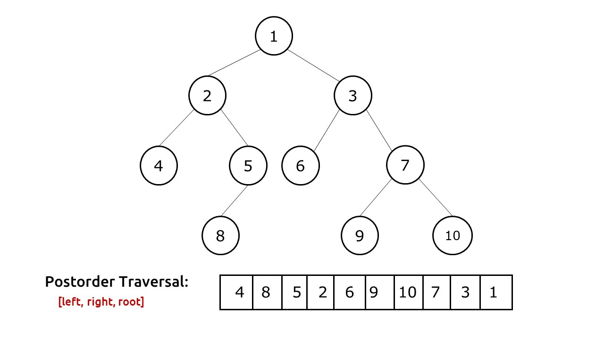
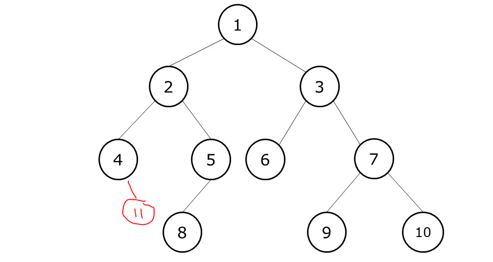

While the Approach #1 is a valid approach, it may not be something you want to use in an interview.

Why? Because we are expected to actually traverse the tree in a "LEFT RIGHT ROOT" manner but we are not doing that in Approach #1. Instead, we are just using sort of a trick to get the output which we would'e gotten if we had traversed "LEFT RIGHT ROOT".

Because what if you are asked to print the nodes as you traverse them? You are not expected to put all the nodes in some list and then reverse that list and then print them. You are expected to print them as you traverse the tree in a POST-ORDER Traversal manner.

And that's why, we have this second approach which might seem a bit tricky at first but is pretty simple if you get it.

Let's take an example to understand.

Since "POST ORDER" traversal means "LEFT RIGHT ROOT", it means the very first task is to go to the extreme left node. Again, we can use a stack to keep the nodes as we visit them.

So initially, node = root and so stack has [1]. Then, node = root.left so stack has [1,2]. Finally, node = root.left and stack has [1,2,4] and we stop because now, node.left is Null.

Once we reach a node, we know this is the first node to print. So we do that. So, we print "4" and pop it from the stack.

Now, the stack has [1,2]

We will now update the "node" to the "right" child of the node on top of the stack. That is, the right child of node "2". So, node becomes {5} and then iteration ends. 

In next iteration, the same process repeats. We first push "5" in the stack so stack becomes [1,2,5] and then we push "8" in the stack so stack becomes [1,2,5,8]

Now, we print "8" and pop it from stack.

Again we check if the node on top of stack currently (node 5) has a right child or not. If yes, we push that right node to stack. But here, there is no right child so we continue. Note that when this iteration ends, node is Null because we did not update it.

Stack is [1,2,5]

In next iteration, nothing is pushed to stack because "node" is Null. So, we straight away print "5" and remove it from stack.

Now, stack is [1,2]. Now we check again if "2" has a right child or not. Indeed it does. But did you notice something? We have already visited "5" so if we do it again, then we will be in an endless loop now. That's the reason why we need to also keep track of the visited nodes so that we do not put them in the stack again. So, node remains Null and iteration ends.

Stack = [1,2]

And so, in current iteration, nothing is put in the stack since node is Null. And so we print "2".

Now, the top of stack has node 1. We check if this node has a right child. Indeed it does. So, we update node to {3} and iteration ends.

Since node = {3}, we will now take this node and all its left children and put them in the stack. So, stack becomes [1,3,6]

And this process continues till stack becomes empty.

And that's the whole process.

# ANOTHER EXAMPLE

Before looking at the code, let's take one more example.

In the above example, we just added a new node on the right side of {4}.

Let's see what happens now. 

Initially, stack has [1] and so, we keep moving on left till we reach the node {4} and so stack becomes [1,2,4]

Now, as per our logic, we will print "4". But that is not correct here. Because, since "4" has a right child as well, it should be the first to get printed. And that's an important change we need to make in our code.

Whenever we keep traversing on the left side in each iteration, as soon as reach a node that has no left child, it might have a right child so we will then update the node to that right child and do the whole left traversal for it as well.

So, we will only stop until we reach a node that has no left and no right child. And this small change is what makes our code work.

So, here is the code -

    def postorderTraversal(root):
            
            # Output list to return
            output = []
            
            # If there is no node at all, return []
            if not root: return output
            
            # Stack
            stack = []
            
            # A set to keep track of nodes already traversed
            visited = set()
            
            # To keep track of the node
            node = root
            
            while True:
                
                # Take the current node and keep going on left side
                # If there is no node on left, then go to the right once (if right child exists)
                # And then repeat
                # We do not want to add the same node twice in the stack so we can use a set to ensure that
                    if node not in visited: stack.append(node)
                    visited.add(node)
                    node = node.left if node.left else node.right
                        
                # If stack is empty, we have traversed all the nodes so we can break
                if not stack: break
                    
                # Now, we can take the node on top of the stack and push its value in output
                top = stack.pop()
                output.append(top.val)
                
                # If the node on top of stack has a right child, update "node"
                # Because remember that we want to always print "right" first before we print the "root"
                # So, if the node on top of stack has a "right" child, it should be given priority
                if stack and stack[-1].right: node = stack[-1].right

            # Finally, return the output list in reverse
            return output

If you compare this code with the code of "IN ORDER TRAVERSAL", you will find that the code is almost the same except for some things like in "POST ORDER" traversal, we use a Set because it is possible that we traverse same nodes twice and we do not want to put them twice in the stack. 

Also, in case of "POST ORDER TRAVERSAL", we will update the "node" in the nested while loop to "left" or "right", depending on which one is available. Whereas in case of "IN ORDER TRAVERSAL", we only update "node" to "node.left".

The reason is simple. In the "IN ORDER TRAVERSAL", the priority is given as "LEFT ROOT RIGHT". Whereas in "POST ORDER TRAVERSAL", the priority is given as "LEFT RIGHT ROOT". So, the right node has a higher priority than root node in case of "POST ORDER" traversal. Hence, we need to consider the "RIGHT" nodes along with "LEFT" nodes.

Finally, you will notice that we update "node" differently in both codes. For "IN ORDER TRAVERSAL", we update "node" before we pop the top of stack. So basically, "node" is updated to the "right" child of the node on top of stack.

On the other hand, for "POST ORDER TRAVERSAL", we update "node" after we pop the top of stack so the "node" is updated to the "right" child of the new node on top of stack (not the one we popped off).

    