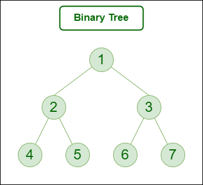

So far, we have seen how we can traverse a tree In "Pre-Order", "In-Order" and "Post-Order" separetely using both Recursive and Iterative approach.

What if we want to get the results of all three traversal in one Traversal?

For that, we need to make some observations first.

Let's take an example for that.

Let's say we have the tree above.

Let's first take a look at how the "Pre-Order" traversal will happen.

    - We visit node {1} and we print it
    - We visit node {2} and we print it
    - We visit node {4} and we print it
    - We visit node {2} for second time but we don't print it
    - We visit node {5} and we print it
    - We visit node {2} for third time but we don't print it
    - We visit node {1} for second time but we don't print it
    - We visit node {3} and we print it
    - We visit node {6} and we print it
    - We visit node {3} for second time but we don't print it
    - We visit node {7} and we print it
    - We visit node {3} for third time but we don't print it
    - We visit node {1} for third time but we don't print it
  
Now, let's see how the "In-Order" traversal will happen - 

   - We visit node {1} but we don't print it
   - We visit node {2} but we don't print it
   - We visit node {4} and we print it
   - We visit the node {2} for the second time and we print it
   - We visit the node {5} and we print it
   - We visit the node {2} for the third time but we don't print it
   - We visit the node {1} for the second time and we print it
   - We visit node {3} and we don't print it
   - We visit the node {6} and we print it
   - We visit node {3} for the second time and we print it
   - We visit node {7} and we print it
   - We visit node {3} for the third but we don't print it
   - We visit node {1} for the third time but we don't print it

Finally, let's see how "Post-Order" traversal will happen - 

   - We visit node {1} but we don't print it
   - We visit node {2} but we don't print it
   - We visit node {4} and we print it
   - We visit the node {2} for the second time but we don't print it
   - We visit the node {5} and we print it
   - We visit the node {2} for the third time and we print it
   - We visit the node {1} for the second time but we do not print it
   - We visit node {3} and we don't print it
   - We visit the node {6} and we print it
   - We visit node {3} for the second time but we do not print it
   - We visit node {7} and we print it
   - We visit node {3} for the third time and we print it
   - We visit node {1} for the third time and we print it
  
Did you notice something? Except for the leaf nodes, for all the other nodes, this is how we print them based on the type of traversal - 

    - If this is our first time visiting that node, we will print it in the Pre-Order Traversal
    - If this is our second time visiting that node, we will print it in In-Order Traversal
    - If this is our third time visiting that node, we will print it in Post-Order Traversal

So, we will do something like this in the code. We will use only one stack, but when we push nodes in the stack, we will also keep track of how many times we have visited this node. If it is our first time, we will simply put "1" along with the node. If we again visit that node, then we will update this value accordingly.

# THE ALGORITHM

So, this is how the whole algorithm works for above example - 

1. Initialize stack with root node and put this pair in stack -> ({1}, 1). Here, second value "1" means this is our first time visiting this node
2. Now, the iteration begins. We check the top of the stack and check what is the second value. Here, we have ({1},1) and second value is "1".
    
    - Since it is "1", it means it should be part of "Pre-Order" traversal so we put it in preOrder list -> [1]
    - And now, we update the value as -> ({1}, 2) because next time it will be our second time visiting this node
    - And now, we push its "left" node in the stack if it exists -> ({2}, 1)
  
Stack is -> [({2},1), ({1}, 2)]
3. The second iteration begins. The top of stack has ({2}, 1). The second value is "1"

    - Since it is "1", it means it should be part of "Pre-Order" traversal so we put it in preOrder list -> [1,2]
    - And now, we update the value as -> ({2}, 2) because next time it will be our second time visiting this node
    - And now, we push its "left" node in the stack if it exists -> ({4}, 1)
Stack is [({4}, 1), ({2}, 2), ({1}, 2)]

4. The third iteration begins. Top of stack has ({4}, 1). The second value is "1".

    - Since it is "1", it means it should be part of "Pre-Order" traversal so we put it in preOrder list -> [1,2,4]
    - And now, we update the value as -> ({4}, 2) because next time it will be our second time visiting this node
    - And now, we push its "left" node in the stack if it exists. But, there is no left node. So nothing gets pushed.

Stack is [({4}, 2), ({2}, 2), ({1}, 2)]

5. The fourth iteration begins. Top of stack has ({4},2) and second value is "2".  

    - Since it is "2", it means we are visiting it for the second time and hence, it should be part of inOrderList -> [4]
    - And now, we update the value as -> ({4}, 3) because next time it will be out third time visiting this node
    - Now, we push its "right" node in the stack if it exists. But, it does not. So, nothing gets pushed.

Stack is [({4}, 3), ({2}, 2), ({1}, 2)]

6. The fifth iteration begins. Top of stack has ({4},3) and second value is "3".  

    - Since it is "3", it means we are visiting it for the third time and hence, it should be part of postOrderList -> [4]
    - And now, we pop this value because we already visited this node three times.
    - And nothing gets pushed

Stack is [({2}, 2), ({1}, 2)]

7. The sixth iteration begins. Top of stack has ({2}, 2) and second value is "2".

    - Since it is "2", it means we are visiting it for the second time and hence, it should be part of inOrderList -> [4,2]
    - And now, we update the value as -> ({2}, 3) because next time it will be out third time visiting this node
    - Now, we push its "right" node in the stack if it exists -> ({5}, 1)

Stack is [({5},1), ({2}, 3), ({1}, 2)]

8. The seventh iteration begins. Top of stack has ({5},1) and second value is "1".

    - Since it is "1", it means it should be part of "Pre-Order" traversal so we put it in preOrder list -> [1,2,4,5]
    - And now, we update the value as -> ({5}, 2) because next time it will be our second time visiting this node
    - And now, we push its "left" node in the stack if it exists. But, there is no left node. So nothing gets pushed.
  
Stack is [({5},2), ({2}, 3), ({1}, 2)]

9. The eighth iteration begins. Top of stack has ({5},2) and second value is "2".

    - Since it is "2", it means it should be part of "In-Order" traversal so we put it in inOrder list -> [4,2,5]
    - And now, we update the value as -> ({5}, 3) because next time it will be our third time visiting this node
    - And now, we push its "right" node in the stack if it exists. But, there is no left node. So nothing gets pushed.
  
Stack is [({5},3), ({2}, 3), ({1}, 2)]

10. The ninth iteration begins. Top of stack has ({5},3) and second value is "3".

    - Since it is "3", it means we are visiting it for the third time and hence, it should be part of postOrderList -> [4,5]
    - And now, we pop this value because we already visited this node three times.
    - And nothing gets pushed
  
Stack is [({2}, 3), ({1}, 2)]

11.  The tenth iteration begins. Top of stack has ({2},3) and second value is "3".

    - Since it is "3", it means we are visiting it for the third time and hence, it should be part of postOrderList -> [4,5,2]
    - And now, we pop this value because we already visited this node three times.
    - And nothing gets pushed

Stack is [({1}, 2)]
  
12.  The eleventh iteration begins. Top of stack has ({1},2) and second value is "2".

    - Since it is "2", it means we are visiting it for the second time and hence, it should be part of inOrderList -> [4,2,5,1]
    - And now, we update the value as -> ({1}, 3) because next time it will be our third time visiting this node
    - And now, we push its "right" node in the stack if it exists. So, ({3}, 1) is pushed to the stack
  
Stack is [({3},1), ({1}, 3)]

13.  The twelfth iteration begins. Top of stack has ({3},1) and second value is "1".

    - Since it is "1", it means we are visiting it for the first time and hence, it should be part of preOrderList -> [1,2,4,5,3]
    - And now, we update the value as -> ({3}, 2) because next time it will be our second time visiting this node
    - And now, we push its "left" node in the stack if it exists. So, ({6}, 1) is pushed to the stack

Stack is [({6},1), ({3}, 2), ({1}, 3)]

14. The thirteenth iteration begins. Top of stack has ({6},1) and second value is "1"

    - Since it is "1", it means we are visiting it for the first time and hence, it should be part of preOrderList -> [1,2,4,5,3,6]
    - And now, we update the value as -> ({6}, 2) because next time it will be our second time visiting this node
    - And now, we push its "left" node in the stack if it exists. There is no left node so nothing is pushed.
  
Stack is [({6},2), ({3}, 2), ({1}, 3)]

15. The fourteenth iteration begins. Top of stack has ({6},2) and second value is "2"

    - Since it is "2", it means we are visiting it for the second time and hence, it should be part of inOrderList -> [4,2,5,1,6]
    - And now, we update the value as -> ({6}, 3) because next time it will be our third time visiting this node
    - And now, we push its "right" node in the stack if it exists. There is no left node so nothing is pushed.
  
Stack is [({6},3), ({3}, 2), ({1}, 3)]

16. The fifteenth iteration begins. Top of stack has ({6},3) and second value is "3"

    - Since it is "3", it means we are visiting it for the third time and hence, it should be part of postOrderList -> [4,5,2,6]
    - And now, we pop this value as we are done with this.
    - Nothing gets pushed

Stack is [({3}, 2), ({1}, 3)]

17. The sixteenth iteration begins. Top of stack has ({3},2) and second value is "2"

    - Since it is "2", it means we are visiting it for the second time and hence, it should be part of inOrderList -> [4,2,5,1,6,3]
    - And now, we update the value as -> ({3}, 3) because next time it will be our third time visiting this node
    - And now, we push its "right" node in the stack if it exists. So, ({7},1) is pushed to the stack

Stack is [({7}, 1), ({3},3), ({1}, 3)]

18. The eighteenth iteration begins. Top of stack has ({7},1) and second value is "1"

    - Since it is "1", it means we are visiting it for the first time and hence, it should be part of preOrderList -> [1,2,4,5,3,6,7]
    - And now, we update the value as -> ({7}, 2) because next time it will be our second time visiting this node
    - And now, we push its "left" node in the stack if it exists. There is no left node so nothing gets pushed.

Stack is [({7}, 2), ({3},3), ({1}, 3)]

18. The ninteenth iteration begins. Top of stack has ({7},2) and second value is "2"

    - Since it is "2", it means we are visiting it for the second time and hence, it should be part of inOrderList -> [4,2,5,1,6,3,7]
    - And now, we update the value as -> ({7}, 3) because next time it will be our third time visiting this node
    - And now, we push its "right" node in the stack if it exists. There is no right node so nothing gets pushed.
  
Stack is [({7}, 3), ({3},3), ({1}, 3)]
19. The twentieth iteration begins. Top of stack has ({7},3) and second value is "3"

    - Since it is "3", it means we are visiting it for the third time and hence, it should be part of postOrderList -> [4,5,2,6,7]
    - And now, we pop this value.
    - Nothing gets pushed.
  
Stack is [({3},3), ({1}, 3)]

20. The twenty-one iteration begins. Top of stack has ({3},3) and second value is "3"

    - Since it is "3", it means we are visiting it for the third time and hence, it should be part of postOrderList -> [4,5,2,6,7,3]
    - And now, we pop this value.
    - Nothing gets pushed.
  
Stack is [({1}, 3)]

21.  The twenty-two iteration begins. Top of stack has ({1},3) and second value is "3"

    - Since it is "3", it means we are visiting it for the third time and hence, it should be part of postOrderList -> [4,5,2,6,7,3,1]
    - And now, we pop this value.
    - Nothing gets pushed.

And finally, stack becomes empty.

So, these are the lists - 

    preOrderList ->  [1,2,4,5,3,6,7]
    inOrderList ->   [4,2,5,1,6,3,7]
    postOrderList -> [4,5,2,6,7,3,1]
  
And that's the whole algorithm.

# THE CODE

    def allInOne(root):
            
        # Lists for respective traversals
        preOrderList, inOrderList, postOrderList = [], [], []
            
        # Stack (Initially, it will have the root node with second value as "1")
        stack = [[root, 1]]
            
        # While the stack is not empty
        while stack:
                
            # Is the node on top of stack being visited for the first time?
            if stack[-1][1] == 1: 
                    
                # Put the value in the preOrderList
                preOrderList.append(stack[-1][0].val)
                    
                # Update the visitCount
                stack[-1][1] += 1
                    
                # Push the left child in the stack, if it exists
                # Initially, the visit count will be "1" for this left child
                if stack[-1][0].left: stack.append([stack[-1][0].left, 1])
                
            # Is the node on top of stack being visited for the second time?
            elif stack[-1][1] == 2:
                    
                # Put the value in the inOrderList
                inOrderList.append(stack[-1][0].val)
                    
                # Update the visitCount
                stack[-1][1] += 1
                    
                # Push the right child in the stack, if it exists
                # Initially, the visit count will be "1" for this right child
                if stack[-1][0].right: stack.append([stack[-1][0].right, 1])
                
            # Is the node on top of stack being visited for the third time?
            else:
                    
                # Put the value in the postOrderList
                postOrderList.append(stack[-1][0].val)
                    
                # Pop the node
                stack.pop()
                    
        # Finally, print the three lists
        print("Pre-Order Traversal -> ", preOrderList)
        print("In-Order Traversal -> ", inOrderList)
        print("Post-Order Traversal -> ", postOrderList)