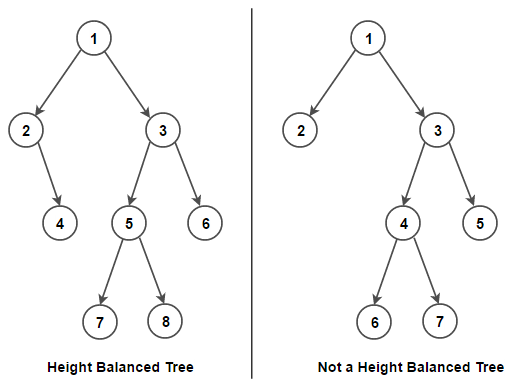

# PROBLEM STATEMENT

Given a binary tree, determine if it is height-balanced.

# EXAMPLE

    Input: root = [3,9,20,null,null,15,7]
    Output: true

# WHAT IS A HEIGHT BALANCED TREE

So, what is a "Balanced" binary tree?

As per definition, it is a Binary Tree where for every node, the difference in heights between its left and right subtree is at most "1". It should not exceed "1".

Let's take an example.

Why is the tree on right not balanced whereas the tree on left is balanced?

Let's see.

The condition is that - 

    The absolute difference between height of left subtree and height of right subtree should not exceed "1"

For left three, when we are at the node {1}, the height of the left subtree is "2" and the height of right subtree is "3". So, the difference is "3 - 2" -> 1. Hence, the condition is valid here.

Now, let's check if for the node {2} this condition is valid. Its left subtree doesn't exist so height of left subtree = 0. Its right subtree as a node {4} and the height is 1. The difference is "1-0"=> 1 and hence condition is valid here.

Let's check the node {3}. Its left subtree has a height "2" and the right subtree has a height "1" so difference is 1. Hence, condition is valid.

And in this way, for each node, the difference in heights is <= 1.

And so, the tree is a Height Balanced Binary Tree.

Now, let's take the other tree on the right side.

Root node is {1} and its left subtree has a height "1". Its right subtree has a height "3". So the difference is "2". And since the difference is > 1, it is not height balanced.

# THE NAIVE APPROACH

So, if we just look at these examples, this is what we are doing - 

    1. For each node, get height of left subtree and right subtree
    2. If differene in heights is > 1, then it is not a Height Balance Binary Tree so return False
    3. If the difference in heights is <= 1, then repeat the process for the left child and right child (if they exist)
    4. If either left or right subtree is not height balanced, then return False
    5. Otherwise, return True

So, we need two recursive functions here. First to get the Height of a tree, and the second to check if a tree is balanced.

What is the Time Complexity of this approach?

The height function will be O(N) in worst case. And on top of that, we are traversing the tree as well so O(N) for that too.

And so, the overall time complexity becomes O(N^2). This is not efficient.

The reason for not an efficient solution is that we have to get the heights of the left and right subtrees which takes a lot of time so if somehow we can optimize this part, we can optimize the whole code.

# THE OPTIMAL APPROACH

If we think about it, then the way we check if a tree is balanced at any point we if the node at which we currently are is balanced. And that is checked by checking the difference between the left and right subtrees. 

So, why not use just one recursive function for height calculation?

At any point, if the absolute difference between the heights of left and right subtree is not > 1, we can return "-1" instead of the maximum of those two heights.

And this small change will eliminate the use of a second recursive function which in turn calls the recursive height function.

So the idea is that we will use the function to calculate the height of the binary tree and if this tree is balanced, it will give us the height value at the end. But if it is not, it will return -1. That's the whole idea!