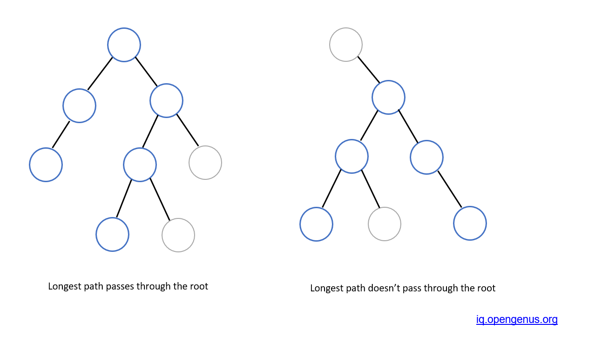

# PROBLEM STATEMENT

Given the root of a binary tree, return the length of the diameter of the tree.

The diameter of a binary tree is the length of the longest path between any two nodes in a tree. This path may or may not pass through the root.

The length of a path between two nodes is represented by the number of edges between them.

# EXAMPLE

    Input: root = [1,2,3,4,5]
    Output: 3

Explanation: 3 is the length of the path [4,2,1,3] or [5,2,1,3].

# APPROACH

So, how can we define the diameter of a tree? We can say - 

 - Diameter is the longest path between any two nodes in a tree
 - This path doesn't necessarily need to be through the root of the tree

# NAIVE APPROACH

The NAIVE approach is pretty simple.

Let's say we take the left tree. In this case, we if we are the root node, then we see that the height of left subtree is "2" and the height of right subtree is 3

So, if a path goes through the root node, then that path's length will be 3 + 3 => 6. And "6" is also the diameter for the left tree because there is no longer path possible for this tree.

For the right tree, the story is similar, except that the path doesn't go through the root node. Instead, it goes through the top node of the right subtree.

So, we can do one thing -

For each node, we can take the height of left subtree and t he height of the right subtree and then the sum of them will be the longest path that goes through that node. 

And in this way, we can calculate this longest path for each node and then get the final maximum path length, which is the diameter.

But, since for each node, we have to calculate left height and right height, it means we will have a recursive function inside a recursive function and in worst case, the time complexity is O(N^2). So, this is not optimal.

# OPTIMAL APPROACH

Since all we are doing is getting the height of left subtree and height of right subtree and then updating the maximum path length so far, we can do this updation in a single recursive function.

So, if we are at any node and from it, we have a left height value "lHeight" and a right height value "rHeight", then the path through that node will have a length of "lHeight + rHeight". Pretty simple. So we can update the diameter accordingly.

And in this way, we used a single Recursive function and so, the time complexity comes down to O(N).

