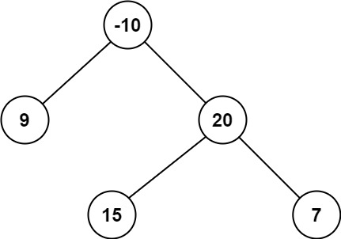
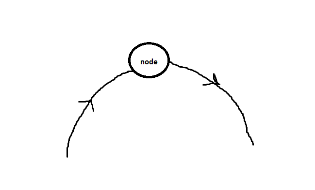

# PROBLEM STATEMENT

A path in a binary tree is a sequence of nodes where each pair of adjacent nodes in the sequence has an edge connecting them. A node can only appear in the sequence at most once. Note that the path does not need to pass through the root.

The path sum of a path is the sum of the node's values in the path.

Given the root of a binary tree, return the maximum path sum of any non-empty path.

# EXAMPLE

Output: 42

Explanation: The optimal path is 15 -> 20 -> 7 with a path sum of 15 + 20 + 7 = 42.

# APPROACH

The Brute Force way is to go over every single pair of nodes and then see what is the maximum path sum between those two. But this is a very inefficient and complicated approach and so, it is of no use.

But there is an optimal way to solve this problem. We will be using a similar pattern as the previous problems like checking of balanced binary tree, getting the diameter of a binary tree and so on.

When we had the problem of calculating the maximum depth in a binary tree, then we used a recursive approach where we first get the maximum depth of left subtree, the maximum depth of right subtree, and then get the maximum out of those two to get the maximum depth in the tree.

Here, the approach will be similar. Since we want the maximum path sum in a binary tree, we can use a recursive approach so that for each node, we can find the maximum path sum on its left, the maximum path sum on its right and then update the overall maximum path sum for the whole tree accordingly.

Basically, we want to take each node and assume that there is a "curved" path where the node is on top of that curve. Something like in above image.

For example, in above example, we start with the root node {-10}. On its left, the subtree has a root node {9} and on its right, the subtree has root node {20}.

Now, if there is a curved path where node {-10} is on top of that curved path, then the path that will give the maximum sum out of all those will be -> '

    -10 + (maximum path sum for left subtree + maximum path sum for right subtree)

And so, it means, when we are at node {-10}, we need to make a recursive call for left and right subtrees.

So, first we make a recursive call for the maximum path sum of node {9}. Now, on its left, there is Null and on its right, there is Null. So, for node {9}, the maximum path sum on left and on right are both 0.

This means, if there is a curved path that goes through node {9} and node {9} is at the top of this path, then the maximum path sum will be -

    9 + (0 + 0) => 9

So, we update the overall maximum path sum to 9 (since initially it is -infinity)

Now, the recursive call ends so what should be returned for the node {9}?

We should return the max of sum of these three paths - 

    1. left -> {9}
    2. right -> {9}
    3. {9}

Why not left -> {9} -> right?

Because remember that what we return here will then be used as the maximum path sum on left of node {-10}

And a valid path cannot include a node twice.

We cannot have a path like this - 

left -> {9} -> {right} -> {9} -> {-10}..... and so on

That's why the value we return is the max of sum of above three paths only.

In this case, we return "9".

And now, the second recursive call happens for right subtree that has root as {20}.

At node {20}, we make recursive calls for left (15) and right (7).

When we are at node {15}, for it, the max path sum is returned as "15".

And for node {7} it is returned as "7".

Now, we update the overall maximum path sum of the three - 

So far, it was "9", but now, it can be updated.

These are the candidates -

 1. node 15 -> node 20
 2. node 15 -> node 20 -> node 7
 3. node 20 -> node 7
 4. node 20
   
And so, out of all these, the maximum is 15 + 20 + 7 => 42

So, we update the max path sum to 42

Again, what do we return? We return one of these three path sums -

 1. node 15 -> node 20
 2. node 20 -> node 7
 3. node 20

Because this returned value will be the maximum path sum on the right of node {-10}

So, we return 20 + 15 => 35

It means, now, we have figured out that if we are at node -10, and there is a curved path that goes through the node {-10} with this node on top, the maximum path sum on left is "9" and maximum path sum on right is "35"

so, max path sum will be 9 + -10 + 35 =>34

But since we have already found an even bigger sum (45) before, the overall max path sum is not updated.

And the process ends.

So, finally, we return 45.