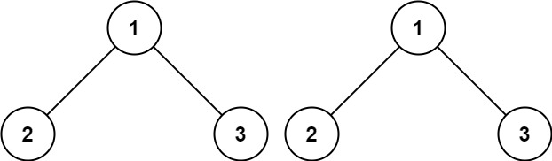

# PROBLEM STATEMENT

Given the roots of two binary trees p and q, write a function to check if they are the same or not.

Two binary trees are considered the same if they are structurally identical, and the nodes have the same value.

# EXAMPLE

Output: true

# NAIVE APPROACH

We can use any traversal technique for the trees. Let's say we use a Pre-Order Traversal.

Suppose we have above two trees.

For first tree, its pre-order traversal will be this -> [1,2,4,5,8,3,6,9,7]

And for second tree, it will be [1,2,4,5,8,3,6,9,7]

Since result of pre-order traversal is the same for both trees, it means they are identical so we can return True.

So, in Naive approach, we can first traverse over the first tree and get the result of the traversal, then do the same with the second tree.

And then, compare these results.

But, this is not efficient because let's say the two trees differ at the root node itself. In that case too, we will traverse over entire trees just at the end to find out that the very first node has a different value in both.

# OPTIMAL APPROACH

Just imagine if we were given two lists to compare instead of two trees. In that case, we would've used two pointers, each for a list and then compared the values at both pointers. If the values matched, we would move to next values. If they don't, we would return False immediately.

We can use a similar logic in this problem.

We can use Pre-Order traversal so when we are at "Root", we compare the values. If both match, then we traverse the left and right subtrees of both the trees at the same time and make sure they are same. 

If they are same, it means the two trees are identical.