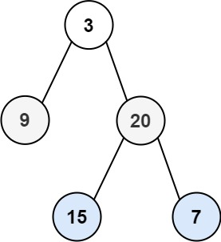

# PROBLEM STATEMENT

Given the root of a binary tree, return the zigzag level order traversal of its nodes' values. (i.e., from left to right, then right to left for the next level and alternate between).

# EXAMPLE

Output: [[3],[20,9],[15,7]]

# NAIVE APPROACH

We know that for Level Order Traversal, we use a Queue data structure to keep track of nodes.

By default, for each level, we traverse in the same order -> left to right

But, in this problem, in each alternate level, the order in which we traverse will get reversed.

So, what we can do is, simply follow the same code as the Level Order Traversal, but just before we return the output list, we make sure we reverse the alternate lists in the output lists.

But, instead of reversing the lists later, we can do this at the same time we push the node values in a sublist.

# OPTIMAL APPROACH

We know that if we have to traverse current level in left to right order, we simply push the node's values in the sublist in the same order as we receive them from the queue. 

But, if the order is right to left, we have to push the node's values in the reverse order in the sublist.

So, for that, we can use a pointer to keep track of the index at which we have to put the currently popped node's value.

For example, if we have to traverse left to right, then the indices will be like 0, 1, 2, 3 ..... n - 1
But, if we have to traverse right to left, then the indices will be like n - 1, n - 2, n - 3...... 0

And that's it.
