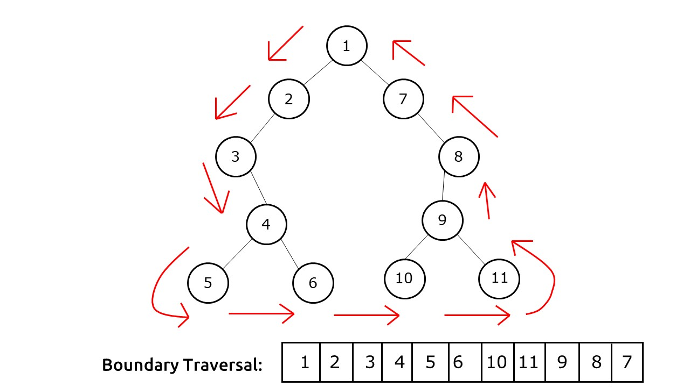
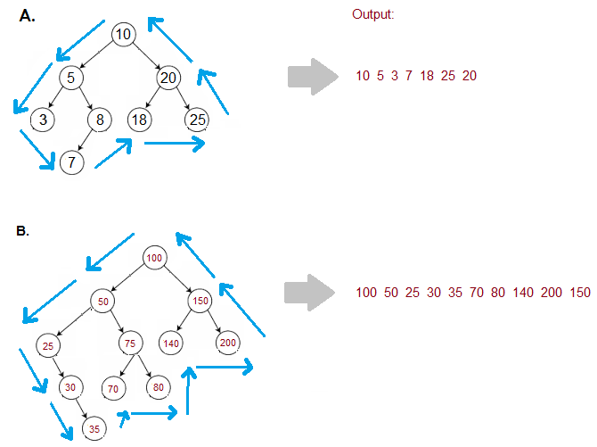

# PROBLEM STATEMENT

Given a Binary Tree, find its Boundary Traversal.
 The traversal should be in the following order: 

 - **Left boundary nodes**: defined as the path from the root to the left-most node ie- the leaf node you could reach when you always travel preferring the left subtree over the right subtree. 
 - **Leaf nodes**: All the leaf nodes except for the ones that are part of left or right boundary.
 - **Reverse right boundary nodes**: defined as the path from the right-most node to the root. The right-most node is the leaf node you could reach when you always travel preferring the right subtree over the left subtree. Exclude the root from this as it was already included in the traversal of left boundary nodes.

Note: If the root doesn't have a left subtree or right subtree, then the root itself is the left or right boundary. 

For example, for the above tree, the Boundary Traversal will be - 

 [1,2,3,4,5,6,10,11,9,8,7]

As shown in above image, Boundary Traversal means we do not take the inner nodes. We only take the outer nodes in the Boundary Traversal.

# APPROACH

There are basically three steps to solve this problem - 

    1. First, we get the left boundary, except the leaf nodes
    2. Then, we get all the leaf nodes
    3. And Finally, we get the Right Boundary in reverse, except the leaf nodes

## 1. GETTING ALL THE LEFT BOUNDARY NODES EXCEPT THE LEAF NODE

This is pretty simple. We start with the root node (if it is not the leaf node), and then we keep adding the value of left child in the output list. As soon as we reach a node on the left side that does not have a left child, we check if it has a right child. If it does, we put it in the output list. And this process continues till we reach the leaf node.

And once we reach the leaf node, it means we are done with the Left Boundary Nodes.

# 2. GETTING ALL THE LEAF NODES OF THE TREE

Now, we want all the leaf nodes of the tree. And here, we can use any one of the three DFS traversals that we learned - In order, Post order or Pre-Order. Beacuse, all we want is to put the value in the result list if a node is a leaf node. 

# 3. GETTING ALL THE RIGHT BOUNDARY NODES IN REVERSE

Finally, we do a similar thing with the Right Boundary Nodes as we did for Left Boundary Nodes. But, since we want the order to be reversed, we can use a Stack here to keep the values of all the Right Boundary Nodes as we traverse them from top to bottom. So that at the end, we can pop them from stack and put them in output list in reverse order.