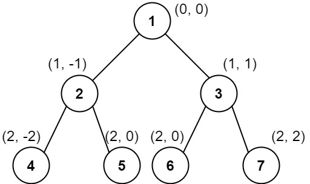

# PROBLEM STATEMENT

Given the root of a binary tree, calculate the vertical order traversal of the binary tree.

For each node at position (row, col), its left and right children will be at positions (row + 1, col - 1) and (row + 1, col + 1) respectively. The root of the tree is at (0, 0).

The vertical order traversal of a binary tree is a list of top-to-bottom orderings for each column index starting from the leftmost column and ending on the rightmost column. There may be multiple nodes in the same row and same column. In such a case, sort these nodes by their values.

Return the vertical order traversal of the binary tree.

# EXAMPLE

Output: [[4],[2],[1,5,6],[3],[7]]

Explanation:
Column -2: Only node 4 is in this column.
Column -1: Only node 2 is in this column.
Column 0: Nodes 1, 5, and 6 are in this column.
          1 is at the top, so it comes first.
          5 and 6 are at the same position (2, 0), so we order them by their value, 5 before 6.
Column 1: Only node 3 is in this column.
Column 2: Only node 7 is in this column.

# APPROACH

We can use a dictionary/hash table to keep track of the (row,col) and the nodes at that (row,col) point.

In this way, at the end, when we construct the final output list, we know that if at a particular (row,col), we have multiple nodes, we have to first make sure they are in a sorted order before we push them in the output list.

# **BFS APPROACH**

The solution uses BFS so we are using a queue data structure. Since we also have to keep track of the column of each node, we will push an extra value in the queue for each node which will be the column of that node. And to keep track of the row, we just need to keep track of the level we are currently at. 

And that's pretty much it!

# **DFS APPROACH**
I used PreOrder traversal but you can use any.

The idea is similar to BFS approach. In the DFS approach, we have to keep track of the current column, current row, total rows, minimum column value and the maximum column value. 