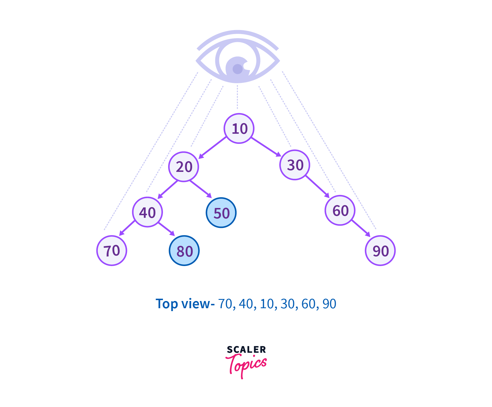

# PROBLEM STATEMENT

Given below is a binary tree. The task is to print the top view of the binary tree. The top view of a binary tree is the set of nodes visible when the tree is viewed from the top.

For example, in the above image, if the tree is viewed from the top then the nodes {50} and {80} won't be visible because they are overshadowed by the nodes above.

And if we view the tree from the top, it will appear as a linear structure with values from left to right in this way - 

    [70,40,20,10,30,60,90]

And so, for a given Binary Tree, the task is to return this list of values.

# BFS APPROACH

When we view the tree from the top, we can consider each node to be in a column. And in this way, we can say that the first node in its column will be the one that we will see. And if this column has more nodes, those will not be visible because those will be overshadowed by the first node.

So basically, we just have to take the first node in each column and then return the node values from left to right.

This is a similar scenario as the previous problem where we had to do a Vertical Order Traversal of the tree. Here, we do the same but here, we just want the first node in each column, not all the nodes in that column.

So, we can use a Dictionary to keep track of the columns and the first nodes in them.

In the end, we just have to construct the final output list.

# DFS APPROACH

Just like how in the problem regarding "Vertical Order Traversal" of a tree we used DFS to solve that problem, we can do the same here.

Again, the difference is that in that problem, we had to get all the nodes in one column but here, we just have to get the first node.

In Level Order Traversal, we know that we will go level by level so for every new column number, we are sure that the node we encounter first is the first node in that column. But, the same cannot be said for DFS. It is possible that in DFS, we traverse the nodes in lower levels before we traverse the nodes in higher levels for the same column. So, there is one extra thing we need to keep track of in the DFS approach and that's the row number or the level of the node.

If a certain column number is already present in the dictionary, we also need to check if the node in dictionary at that column number is at a lower level than current node. If yes, we can replace the node in the dictionary with current node.

And this is the only change compared to the BFS approach.