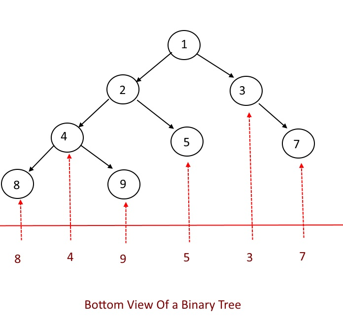

# PROBLEM STATEMENT

Given below is a binary tree. The task is to print the bottom view of the binary tree. The bottom view of a binary tree is the set of nodes visible when the tree is viewed from the bottom.

For example, in the above image, if the tree is viewed from the bottom then the nodes {2} and {1} won't be visible because they are overshadowed by the nodes below them.

And if we view the tree from the bottom, it will appear as a linear structure with values from left to right in this way - 

    [8,4,9,5,3,7]

And so, for a given Binary Tree, the task is to return this list of values.

# BFS APPROACH

This problem is simply the opposite of the previous problem that we did -> Top View of a Binary Tree.

In the Top View, we wanted the first node in each column, whereas in the bottom view, we want the last node in ach column. And that's pretty much it.

For each column number, we simply keep updating its node as we traverse the tree level by level. And at the end, we simply construct the final output list. Unlike the "Top View" problem, we do not check if the column number is already present because even if it is already present we want to replace the node with current one because we know we are at a lower level than before.

# DFS APPROACH

Just like the BFS approach, the DFS approach is the opposite of the "Top View of a Binary Tree" problem.

In "Top View", we only pushed a node to the dictionary if its column number didn't already exist or if the column number existed but the node at that column number in the dictionary was at a lower level than current node since we were prioritizing the nodes at a higher level.

But here, we do the opposite. We put a node in the dictionary if its column number doesn't already exist or if the column number already exists but the node in the dictionary at that column number is at a higher or equal level as the current node (Why we are checking for equal levels? That's because if two nodes are at the same (row, col) value, we want the node that comes later from left to right).

And well, that's the whole idea.