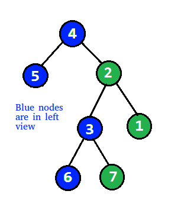

# PROBLEM STATEMENT

Given the root of a binary tree, imagine yourself standing on the left side of it, return the values of the nodes you can see ordered from top to bottom.

Output: [4,5,3,6]

# BFS APPROACH

This problem is the opposite of the previous problem where we found the "Right View" of a Binary Tree.

The left side view means the leftmost node in each level. So, we can use Level Order Traversal here and as we go over each level, we will take the first node in each level.

# DFS APPROACH

Again, this is the opposite of the "Right Side View of Binary Tree" problem.

The DFS Approach requires us to keep track of each level and we also have to use a Dictionary to keep track of each level and the leftmost node in that level.

The difference in this problem is that here, we only update the dictionary if we encounter a level for the first time because that ensures that the current node is the leftmost node of the level.

At the end, we have to construct the final output list.