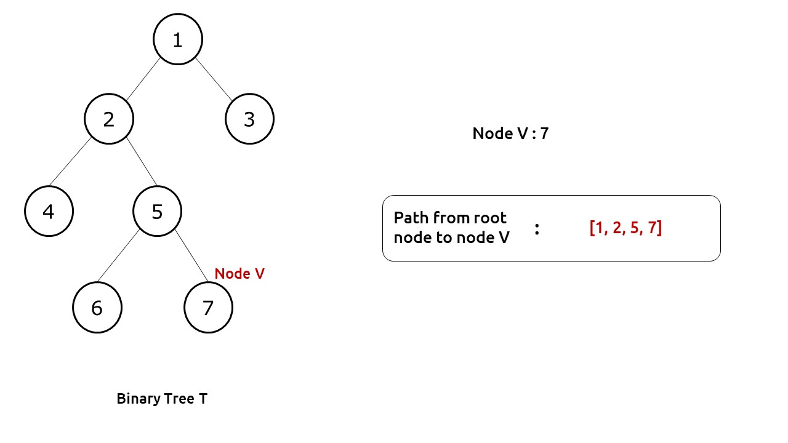
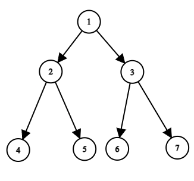

# PROBLEM STATEMENT

You are given a Node's value. Assume that the nodes in the Binary Tree have unique values. You need to print the path from the Root Node to the node with the given value.

Suppose we have a Binary Tree as above. If the node to which we have to reach is node {5}, then the Root to Node path will be - 

    1->2->3

So, we have to return a list with comma separated node values which denote the path from root to node.

For above Binary Tree, the output is - 

    [1,2,3]

# RECURSIVE DFS APPROACH

We will use the Pre-Order Traversal in this problem, the reason being that it is the simplest of the three to implement. We can do it using other two traversals in DFS, but that will make the code a bit more complicated.

Let's take the above example where we have to find the node with value = 7.

We start with the Root Node because remember it is the "Root -> Left -> Right" traversal. We see that root node has a value = 1 so it is not the node that we want to reach. But, it might be the node in the path to the target node so, we will save its value in a list. Path becomes [1]

Now, we traverse the left side of the root node.

We reach Node 2. Again, same logic. Path becomes [1,2]

We traverse the left of Node 2. Same logic. Path becomes [1,2,4]

Now, there is nothing on the left of Node 4. What does it mean? It means that the target node "7" is definitely not on the left side of "4". So, when we traverse the left of 4, that traversal will return False which represents that on the left of 4, we cannot find node 7.

Now, as per Pre-Order traversal, we now check the right side of "4". Again we see that there is nothing on right side and the right side traversal also returns False.

And so, when we are at the node "4", both left and right traversals give us False. So, node "7" is neither on left or on right side of node 4.

What does this mean? It means, the node "4" can never be in the path to the target node. So, we will remove "4" from the path list. Path list becomes [1,2].

And we again reach the node "2" and now, its time to traverse right side of "2" because we know on left, the target node cannot be present.

We reach node 5. We put it in the path list. Path list becomes [1,2,5]

Now we traverse left of 5 and reach 6. We put 6 in the path list. Path list becomes [1,2,5,6]

Now, on left of "6", there is nothing and also on right. So here as well, both the left and right traversals will give us False. It means, "6" cannot be in the path from root to node 7. So, it should be removed from the list.
Path list becomes [1,2,5]

Now, we traverse right side of "5". We reach the node 7. We see that this is the node to which we had to reach. And so, we will put it in the Path list and we know that the path is now found. There is no need to traverse left or right of 7 because we reached the target node. So, we can return True. 

So, when we are at the node "5", the left traversal gives us False but right traversal gives us True. It means "5" is definitely in the path from Root to Node so it should not be removed from the Path List.

Similarly, when we are at the node "2", the left traversal gives False but right traversal gives True. It means "2" is definitely in the path from Root to Node so it should not be removed from the Path List.

Finally, when we are at the Node "1", we see that the left traversal gives us True so it means there is no need to even traverse on right side because we already know that left side has the target node.

So, the recursive function ends.

And finally, the path list we get is - 

    [1,2,5,7]

And that's the whole idea.

So, here are the key points - 

1. When we reach the leaf node and it is not the target node, we know this path does not have the target node so we return False

2. If left traversal returns True, it means the target node is on left side of current root node so no need to traverse right side.

3. If none of the left or right traversals give us True, it means the target node is not on current path so the root node needs to be removed from the path list and we return False.

# ITERATIVE DFS APPROACH

The Iterative Solution is very simple once you understand the main part of it which is the removal of nodes from the path that are no longer useful.

We will use a stack in this approach where initially, the stack has the root node. Then, as we do in Pre-Order traversal, we first push right child and then the left child, if they exist.

And in each iteration, we will pop the top of the stack and push that node's value in the current path so far. If the node we popped is the node that we want to reach, it means we are done and we have the path that we want.

But, if the node we popped is not the target node and it is also the leaf node, it means at current path, we can never find the target node because we are already at the root node. So, at that point, we have to remove this leaf node from path but that is not enough.

Beacuse it is also possible that the node before it is also of no use anymore.

Suppose we have the tree above. We want to reach node with value = 7.

At some point, we will reach the node {4} and we will see that this is a leaf node. At that point, our path will look like this -> [1,2,4]

So, we will pop "4" because it is a leaf node and it is also not the target node. So, path becomes [1,2]

Next, we will reach "5" and again, the same thing happens. Path becomse [1,2] after we remove "5".

And after that, do you think "2" is of any use? NO! Because we already traversed its left and right children and we found that none of the two can lead us to target node. It means our path to the target node cannot include the node {2} as well. So we pop it as well. And again, we check if node {1} is useful or not. We see that the node we just popped is {2} and it is the left child. But, there is till right side to cover. 

So, there are two rules based on which we will pop a node from the end of current path - 

    1. The node we just popped is the right child of the node at the end of current path
    2. The node we just popped is the left child of the node at the end of current path, but the node at the end of current path has no right child.

Both these scenarios mean we have covered both left and right sides of the node at the end of current path and we did not find the target node in either direction so it should be removed as well.

# ITERATIVE BFS (Level Order Traversal) APPROACH

The Level Order Traversal approach is very straightforward. As we traverse each node in a level, we will keep track of the path to that node. And as soon as we find the target node, we can straight away return the path till that node since we are already keeping track of the path so far.

It is important to note that when we push the left or the right child of "node" in the queue, we will do a deep copy of the path till "node" because remember that new_list = my_list doesn't actually create a second list. The assignment just copies the reference to the list, not the actual list, so both new_list and my_list refer to the same list after the assignment.