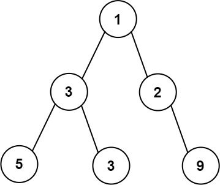
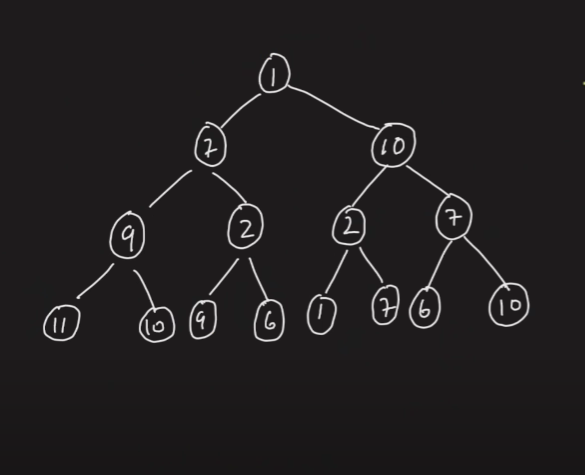
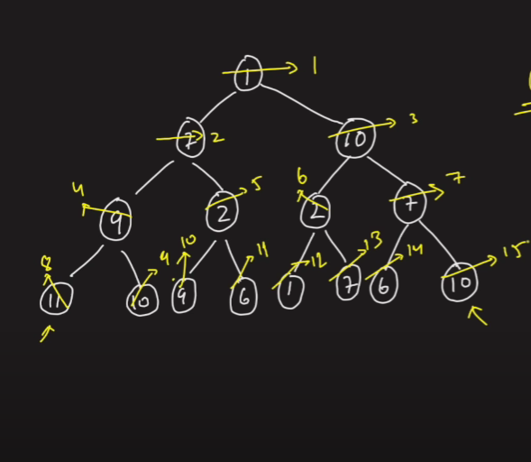
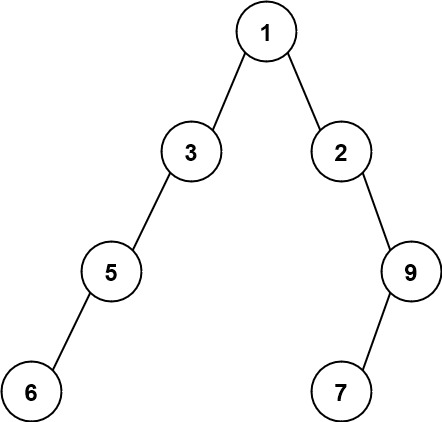

# PROBLEM STATEMENT

Given the root of a binary tree, return the maximum width of the given tree.

The maximum width of a tree is the maximum width among all levels.

The width of one level is defined as the length between the end-nodes (the leftmost and rightmost non-null nodes), where the null nodes between the end-nodes that would be present in a complete binary tree extending down to that level are also counted into the length calculation.

It is guaranteed that the answer will in the range of a 32-bit signed integer.

# EXAMPLE

Output: 4

Explanation: The maximum width exists in the third level with length 4 (5,3,null,9).

# APPROACH

It is not hard to think that since width depends on the level and the nodes in that level, the best way to traverse a tree for this problem is using BFS or Breadth First Search or Level Order Traversal.

Now you may think that we can use a Queue to keep all the nodes as we traverse the tree, even the ones that are Null. But, if you try to write such a solution, the chances are that you will face "Memory limit exceeded" issue. We need to play smart here. We need a way in which for any level, we can quickly find what is the width of the tree at that level.

For that, let's take a tree that is fully filled (A Perfect Binary Tree)

If we take the above Binary Tree, what if we denote each node with a number, something similar to indexing in a list.

If we do that, then the root node {1} will have a number = 1, the node {7} will have a number = 2, the node {10} will have a number = 3 and so on...

So, if we take any level, lets say the last level, we see that the first node is numbered as "8" and last node is numbered as "15". 

So, can we say that the width at that level is - 

    15 - 8 + 1 => 8

Yes we can!

And that's the idea here.

We will try to number the nodes in given Binary Tree in a similar way. Now, you may think what about Null nodes? Let's first generalize something.

When we were at the root node with number = 1, its left child was numbered as 2 and its right child as 3.

When we were at the node with number = 2, its left child was numbered as 4 and its right child as 5.

When we were at the node with number = 3, its left child was numbered as 6 and its right child as 7.

Based on this, we can say that -

    If a node is numbered as "i", its left child will be numbered as  "2*i"
    If a node is numbered as "i", its right child will be numbered as  "(2*i) + 1"

So, if we follow these rules, then we do not even need to care about Null nodes because following these rules for numbering will ensure that we number all the nodes in a tree in correct way as if the tree was full.

Take the above tree as an example. There are a few Null nodes in between. Let's see how we will number the non null nodes.

We start with root node {1} so it is numbered as "1".

Since it has a left and right child, we number then as "2" and "3".

Now, when we are at the second level, we have a node {3} numbered as "2" which has a left child so the left child will be numbered as "2 * 2" which is "4".

Similarly, we have a node {2} numbered as "3" and since it has a right child, it will be numbered as "(2 * 3) + 1" which is 7.

So now you can see that even if there are Null Nodes, we are correctly numbering the Non Null nodes that are present in the Binary Tree.

And that's the whole approach.

For any level, the width is simply - 

    rightmost node's number - leftmost node's number + 1

And we just need to find the maximum value of the above formula for a Binary Tree. That would be the maximum width.