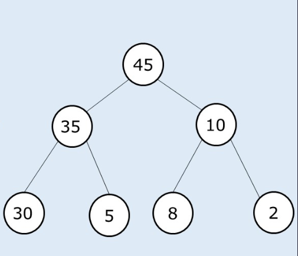

# PROBLEM STATEMENT

Given a binary tree having n nodes. Check whether all of its nodes have the value equal to the sum of their child nodes. Return 1 if all the nodes in the tree satisfy the given properties, else it return 0.

For every node, data value must be equal to the sum of data values in left and right children. Consider data value as 0 for NULL child.  Also, leaves are considered to follow the property.

# EXAMPLE

The Tree above follows the Children Sum property because every node is sum of its left and right child. So, output is 1.

# BFS APPROACH USING QUEUE

As we know, in BFS Approach, we use a Queue for the traversal. So, we will use the same here with the only change being the extra check that we make to see if a node is equal to the sum of its left and right children. If not, we return 0, otherwise we keep traversing the tree level by level.

# DFS APPROACH USING RECURSION

We can also use DFS to solve this problem. We can use Recursion here.

There are two ways to solve it using DFS. Either we check the nodes from bottom to top, or we start checking from top to bottom. Both will work.

The first approach where we first traverse left, then we traverse right and then we check the root node is using the POST ORDER TRAVERSAL. The second approach uses PRE ORDER TRAVERSAL where we first check the root node and then we traverse left and right.

## APPROACH #1 USING POST ORDER TRAVERSAL

When we do the POST ORDER TRAVERSAL, if we are at a Null Node, then we will return -1 so that we know that this particular node is Null. In this way, whenever "left" and "right" children are both -1, we know that this is a leaf node so it always follows the Children Sum Property. And so, we return the value of this leaf node to be used in previous recursive calls.

But, if it is not a leaf node, then we check if it follows Children Sum property. At any time, if left or right child's value is 0, it means that either left or right subtree does not follow the Children Sum Property so we can straight away return 0.

Otherwise, we return back the root node's value to be used in previous recursive calls.

## APPROACH #2 USING PRE ORDER TRAVERSAL

This one is simpler and shorter than above approach. Here, we first check if root node's value is equal to the sum of children. If not, we will return 0. If yes, then we check if the same is true for left and right subtree.

If yes, then the whole tree is following the Children Sum Property.