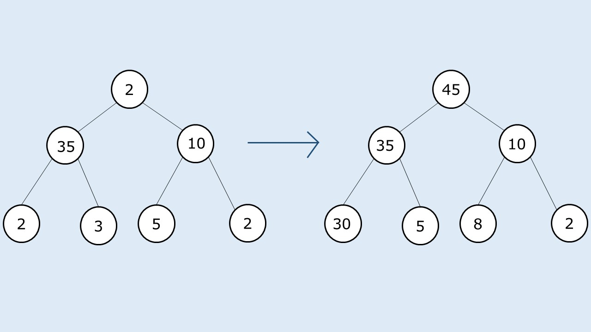
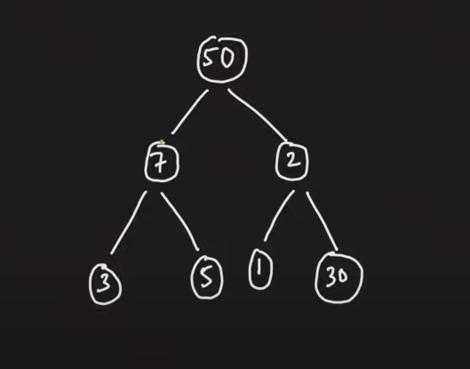

# PROBLEM STATEMENT

Given a binary tree of nodes 'N', you need to modify the value of its nodes, such that the tree holds the Children sum property.

A binary tree is said to follow the children sum property if, for every node of that tree, the value of that node is equal to the sum of the value(s) of all of its children nodes( left child and the right child).

Note :
 1. You can only increment the value of the nodes, in other words, the modified value must be at least equal to the original value of that node.
 2. You can not change the structure of the original binary tree.
 3. A binary tree is a tree in which each node has at most two children.      
 4. You can assume the value can be 0 for a NULL node and there can also be an empty tree.

# EXAMPLE

# APPROACH

What if we start form leaf nodes and then make our way to the top?

For example, in above example, if we start from leaf nodes, initially, we have leaf nodes "2" and "3" which sum to "5". Their parent node is "35". Since 35 > 2 + 3, it means that we need to increment the values of the children here. We can increment values in any way. Let's say that we update left child to "32" and the right child remains as "3". It will be a valid update because we are not decrementing any value.

Now, we come to leaf nodes "5" and "2" which sum to 7. Since their parent is 10, it means we need to update the children nodes here since 10 > 5 + 2.

So, let's update right child to 5 and keep left child as 5 only. It is a valid update.

Now, we see that nodes 35 and 10 have parent as 2. So, this time the parent needs to be incremented to 45.

And well, we have a tree that follows Children Sum property.

So, this approach seems to be working.

Let's take another example.
Here, we start from leaf nodes "3" and "5" which sum to 8 and their parent is "7". Since 7 < 8, we can update the parent node data to 8.

Now, we come to the nodes "1" and "30". Their sum is 31 so we can update the parent to 31 as well.

And now, for the node "50" the left child has value 8 and right child has value 31. The sum is 39. But, the root node has a value 50.

Ideally, the root node must be "39" if this tree has to follow Children Sum Property.

But, we cannot update the root node to "39" because we can only increment it, not decrement it.

What if we had gone from top to bottom?

When we are at node "50", we see that left is 7 and right is 2. So, we can increment the children. But, we have to increment them in such a way that we do not have to decrement any node as we traverse down. And that's the complicated part.

Because lets say we update left node to 7 and right node to 43. Then, when we are at "7", left child is 3 and right child is 5, with sum as 8. So, our code will fail here because we cannot increment the node "7" as we have already updated it for the node "50". And we cannot decrement "3" or "5" because decrementing is prohibited.

And that's why, all the above approaches fail. The reason is that we need a strategy to update the node value.

# MAXIMUM VALUE IN A BINARY TREE APPROACH

Now, let's talk about the approach that will work here.\

We know that we can increment a node, right? Then, just imagine what if for the above example, we update the leaf nodes to 50?

Let's say we are at nodes "3" and "5". We update them to 50 and 50.

Since we know that no value in original tree is greater than 50, it means that any time we have to update a node, we will always use the increment operation.

For example, we update "3" and "5" to 50 and 50. 

Now, we know the parent value is at most "50" which means it needs to be incremented to 100 to be equal to child node values.

Similarly, we update the nodes "1" and "30" to 50 and 50 and the same thing happens for node "2".

And now, for the node "50", left child is 100 and right child is 100 so it is incremented to 200.

And now, the tree follows the Children Sum property.

And that's the approach!

Let's take the very first example to see if this approach works for that as well.

At leaf, we have nodes "3" and "2". So we update them to 35 and 35 since 35 is the maximum value in the tree.

Now, for node "35", we update it to 70 to match the sum of children.

Similarly, we do the same for the node "10" and leaf nodes "5" and "2".

And finally ,we update the node "2" to 140 to match the sum of left and right child.

And now, the tree is following the Children Sum Property.