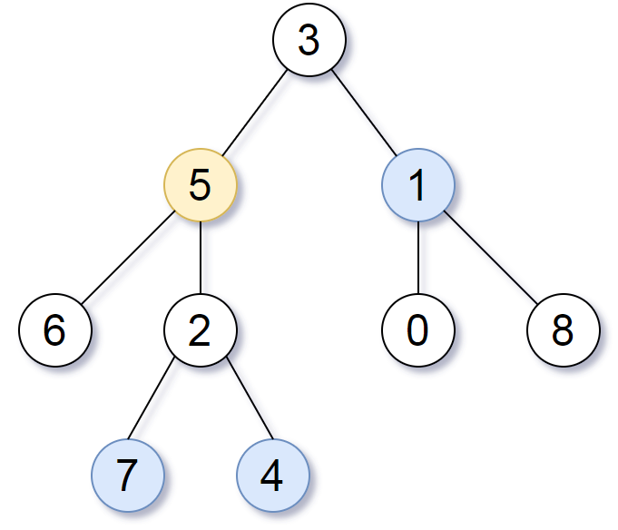

# PROBLEM STATEMENT

Given the root of a binary tree, the value of a target node target, and an integer k, return an array of the values of all nodes that have a distance k from the target node.

You can return the answer in any order.

# EXAMPLE



Input: target = 5, k = 2
Output: [7,4,1]

Explanation: The nodes that are a distance 2 from the target node (with value 5) have values 7, 4, and 1.

# APPROACH

The issue in a Binary Tree is that from a node, we can go downwards to its left and right children. But, from a child, we cannot go back to the parent node because a child does not have any pointer to the parent node. 

Why is that an issue here?


Let's take the above example. Here, target is "5". So, the simplest way to find nodes at distance 2 is to start from node "5", and then travel in all possible directions from it. That is, towards top, left and right.

We can easily move to left and right but what about top? How to go back to the parent node?

And for that, we need to keep track of the parent node of each node in the tree. We can do that using any traversal technique. So, let's use BFS for that and keep a dictionary / hash table where the keys are nodes and the values are their parent nodes.

And now, this dictionary will be used when we traverse in all directions from the target node.

Since we are asked to find nodes at a distance of 2, when we start from the target node, we are at a distance of 0.

Now, we traverse outwards. That is at the same time, we traverse to top, left and right.

	To traverse top, we can use our dictionary where we can check what is the parent of the targetNode {5}.
	
	It is the node {3}.
	
	And because we have not already visited it yet, we can add it to the queue of nodes that we will visit later.

	Similarly, on left side, we have node {6} and on right, we have node {2} 
	We haven't visited them yet so they are also added to the queue.

And in this way, first iteration ends and now, our distance becomes 1. It means, the nodes at a distance of 1 from target node are {3}, {6} and {2}.

And we do the same process with these nodes in the next iteration. 

	That is, we first take the node {3} and traverse top, left and right. 
	On top, there is nothing because it is the root node.
	On left, we have a {5} but we have already visited it so we won't go towards "5" again. 
	On right, we have {1} which we have not visited so we put it in the queue.

	Next, we have {6}. 
	On top, we have {5} which we have already visited so we don't put it in queue again
	On left, we have nothing and on right we have nothing.

	Next, we have {2}. 
	On top, we have {5} which we have already visited so we don't put it in queue again. 
	On left, we have {7} and on right we have {4}. 
	Since we haven't visited them yet, we put them both in the queue and the iteration ends.

The distance is now updated to "2".

And since k is also 2, it means the nodes that are present in the queue at this point are all at a distance of "2" from the target node. And so, we can stop now and return the node values.

So, the bottom line is that, since we are asked for nodes at a distance of "k" in all directions, we also have to keep track of the parent nodes so that it is helpful when we have to traverse top.

If we were only asked for nodes at a distance k on bottom side, then we wouldn't have required a dictionary at all because in that case, we would've simply traversed towards the bottom which we normally do in tree traversal.

But here, since we also have to traverse top, we have to keep track of parent nodes. So basically, we are turning the Binary Tree into an "Undirected Graph" here. In an Undirected Graph as well, the edges between two nodes are bidirectional which means we can go from Node A to B and also from B to A.
class Solution:
    
    def distanceK(self, root: TreeNode, target: TreeNode, k: int) -> List[int]:
        
        # A Dictionary to keep the parent nodes of every node in the Tree
        # This will be useful when from any node, we have to traverse towards top
        # Because in a Binary Tree, we can easily traverse top to bottom from any node
        # But not from bottom to top because a node does not contain any data about who the parent is
        # Only from the parent we can know who the children are
        parentNodes = {}
        
        # Queue, initially with the root node
        queue = deque()
        queue.append(root)
        
        # While the queue is not empty
        while queue:
            
            # How many nodes are in current level
            nodesInCurrentLevel = len(queue)
            
            while nodesInCurrentLevel > 0:
                
                # Pop the node in front of the queue
                node = queue.popleft()
                
                # If the node has a left child
                if node.left:
                    
                    # Update the dictionary
                    parentNodes[node.left] = node
                    
                    # Push to the queue
                    queue.append(node.left)
                    
                # If the node has a right child
                if node.right:
                    
                    # Update the dictionary
                    parentNodes[node.right] = node
                    
                    # Push to the queue
                    queue.append(node.right)
                    
                
                # Update the count
                nodesInCurrentLevel -= 1
                
        # At this point, we know for each node, what is the parent
        # Now, from the "target" node, we start traversing outwards
        # That is, we traverse top, left and right at the same time
        
        # Queue, initially with the target node
        queue = deque()
        queue.append(target)
        
        # To keep track of visited nodes, initially with the target node
        visited = set()
        visited.add(target)
        
        # While we are not at a distance k from target
        while k > 0:
            
            # How many nodes are in the queue at this point
            # At any time, all nodes in the queue will be at the same distance from target
            nodesInQueue = len(queue)
            
            while nodesInQueue > 0:
                
                # Pop the node in front of the queue
                node = queue.popleft()
                
                # Now, we traverse outwards from this node. That is, towards top, left and right
                # The node on top is its parent (except if it is the root node)
                # If we haven't yet visited the parent node
                if node in parentNodes and parentNodes[node] not in visited:
                    
                    # Put the node in the visited set
                    visited.add(parentNodes[node])
                    
                    # Push the node on top in the queue
                    queue.append(parentNodes[node])
                    
                # The node on left is the left child
                if node.left and node.left not in visited:
                    
                    # Put the node in the visited set
                    visited.add(node.left)
                    
                    # Push the node on top in the queue
                    queue.append(node.left)
                    
                # The node on right is the right child
                if node.right and node.right not in visited:
                    
                    # Put the node in the visited set
                    visited.add(node.right)
                    
                    # Push the node on top in the queue
                    queue.append(node.right)
                
                # Update the count
                nodesInQueue -= 1
            
            # Update the distance
            k -= 1
            
        # Finally, at this point, the queue will have all the nodes that are at a distance "k" from "targetNode"
        # Construct the output list
        output = []
        while queue: output.append(queue.popleft().val)
            
        # Return the output list
        return output
```