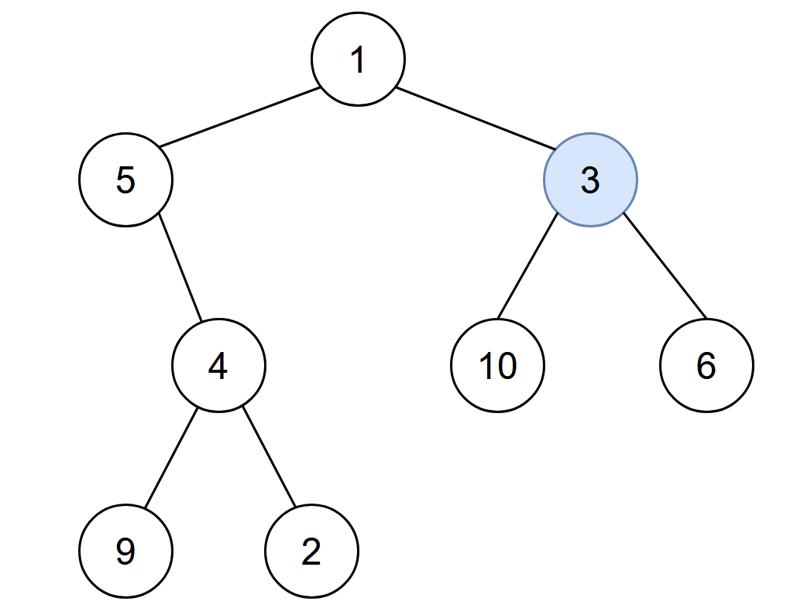

# PROBLEM STATEMENT

You are given the root of a binary tree with unique values, and an integer start. At minute 0, an infection starts from the node with value start.

Each minute, a node becomes infected if:

 - The node is currently uninfected.
 - The node is adjacent to an infected node.

Return the number of minutes needed for the entire tree to be infected.

# EXAMPLE

Input: root = [1,5,3,null,4,10,6,9,2], start = 3
Output: 4

Explanation: The following nodes are infected during:
- Minute 0: Node 3
- Minute 1: Nodes 1, 10 and 6
- Minute 2: Node 5
- Minute 3: Node 4
- Minute 4: Nodes 9 and 2
It takes 4 minutes for the whole tree to be infected so we return 4.

# APPROACH

The idea is the same as the problem -> All Nodes Distance K in Binary Tree

The idea is that when we start from the initial infected node, the infection will be passed over to all the neighboring nodes at the same time. That is, in minute 1, the infection will be passed over to the node on top, left and right. And then the same process continues for all the newly infected nodes.

While it is easy to traverse left and right, we cannot traverse back towards the parent from the child node in a Binary Tree, unless we know what is the parent of that child node. And that's why, we first need to get the data about the parent nodes for every node in the Binary Tree.

And then, we can traverse the tree to find how much time it will take for the entire tree to get infected.