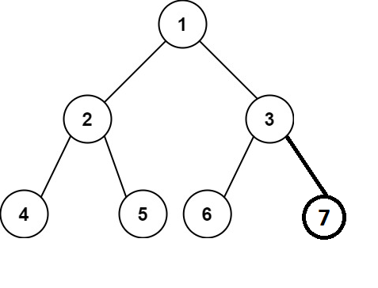
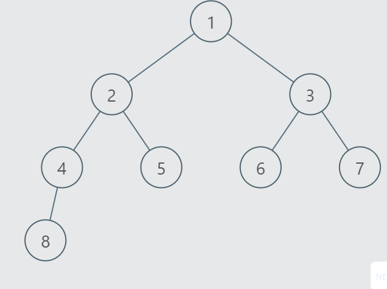

# PROBLEM STATEMENT

Given the root of a complete binary tree, return the number of the nodes in the tree.

According to Wikipedia, every level, except possibly the last, is completely filled in a complete binary tree, and all nodes in the last level are as far left as possible. It can have between 1 and 2h nodes inclusive at the last level h.

Design an algorithm that runs in less than O(n) time complexity.

# EXAMPLE

Output = 6

# APPROACH

There is a reason why this problem asks us to write a solution with a better time complexity than O(N). Because, an O(N) solution is a piece of cake. All we have to do is to traverse the entire tree using any of the traversal methods, and then just return the count at the end.

But, since this is a "Complete" Binary Tree, we can take advantage of its properties.

We know that in a Complete Binary Tree, all the levels are completely filled, except possibly the last level. And in the last level as well, nodes are as far left as possible.

Now, what if a tree has all levels completely filled, even the last level? Then it will become a "Perfect" Binary Tree (which is also a type of "Complete" Binary Tree).

For example, for the above tree, if there was a node on the right of the node {3}, it would be a Perfect Binary Tree, and the number of nodes would be 7.

We see that the height of the tree is 3. Or you can also say there are 3 levels in the above Binary Tree. So, can we say that if a tree is perfect binary tree, the number of nodes are simple - 

    2^height - 1
        OR 
    2^levels - 1

Yes we can say that!

If we have a perfect binary tree and we are at the root, the leftmost node and the rightmost node should be at the same level right?

In above image, we can see that leftmost node is {4} and rightmost node is {7} and they are both at level 3.

So, this is one property of the Perfect Binary Tree that we can use in a Complete Binary Tree to get the number of nodes. But how?

Let's take an example.

When we are at the root node {1}, we see that the leftmost node is at a level 3 whereas the rightmost node is at a level 2 (Suppose we take levels starting from 1).

Now, since the levels are not same, what does it mean? It means that the Tree is not Perfect so we cannot apply the formula "2^levels - 1" to get total nodes.

But, if we know what are number of nodes on left and number of nodes on right, we can get the total nodes as - 

    1 + nodes on left + nodes on right

We add "1" because we also want to accomodate root node.

So now, it becomes a recursive approach. 

We started with countOfNodes(root) and from there, we make recursive calls to get the total nodes as - 

    1 + countOfNodes(root.left) + countOfNodes(root.right)

So, when we reach the node {2}, what is the level of leftmost node for the subtree with root node as {2}? It is 2. And similarly, what is the level fo rightmost node? It is also 2. What does it mean? It means that the subtree with root node as {2} is a Perfect Binary Tree so we can simply get number of nodes by doing - 

    2^2 - 1 => 3

So, countOfNodes(root.left) returned as 3

Now, we come to right child which is node {3}.

The leftmost node is at level 2 but the rightmost node is at level 1 (which is the node {3} itself). So, there is a difference in nodes. This means, the tree with root as {3} is not a perfect binary tree so we cannot apply the formula. Hence, we again make recursive calls with root as {3} -

    1 + countOfNodes(root.left) + countOfNodes(root.right)

root.left is node {6}. There is no node on left and right so for it, levels for leftmost and rightmost nodes are the same. That is "1". So, total nodes become 2^1 - 1 => 1

For root.right, there is nothing so it returns 0.

And so, we get number of nodes as 1 + 1 + 0 => 2

It means, for the tree with root node as {3}, the total nodes are 2.

And so, we finally return to our original root node {1}.

From left we got number of nodes as 3 and from right, we got number of nodes as 2.

It means, total number of nodes in the given Complete Tree are - 

    1 + 3 + 2 

That is => 6

And that's the whole logic of doing this problem in a lesser time complexity than O(N).

# THE TIME COMPLEXITY

So, what is the time complexity of the above approach?

In each recursive call, we are getting the left and right subtree heights / levels.

So, in worst case, for getHeights method, the time complexity will be O(H) where "H" is the height of the tree. 

Now, for the counting of nodes, we are not traversing the entire tree in this approach. As soon as we find that a subtree is a Perfect Binary Tree, we can quickly get nodes in that tree by our formula.

So, the worst case would be something like above.

In the above tree, we will traverse all the leftmost nodes one by one. But, for the right subtree, as soon as we reach root.right, we see that it is a Perfect tree so we immediately get its number of nodes.

It means, we traversed the same number of nodes as the height of it. That is O(H)

So, we can say that the total time complexity is O(H^2)

Now, for a Complete Binary Tree, height is roughly LogN. So, we can write the time complexity as O(LogN * LogN) or, O((LogN)^2).