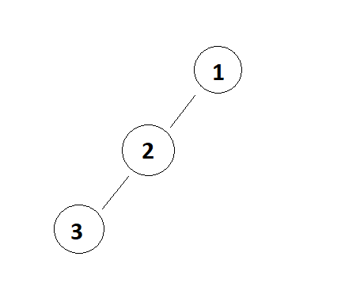
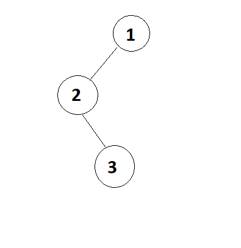
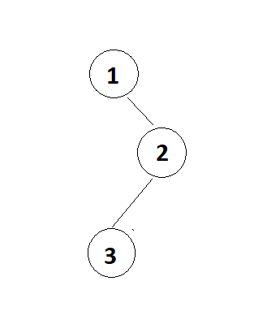
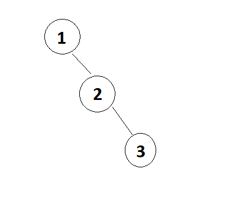
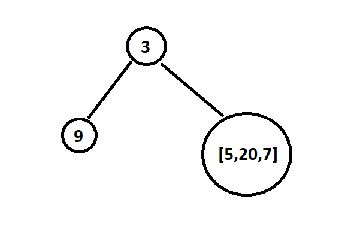
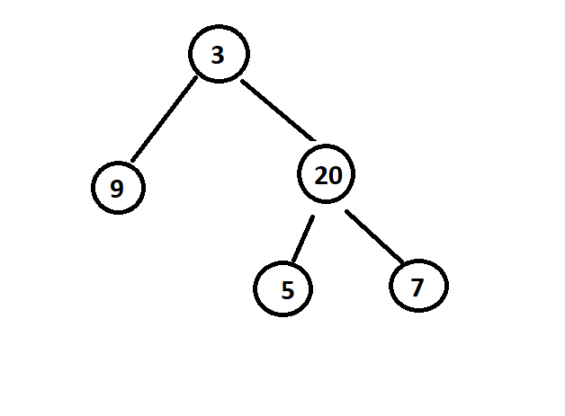

The question is, if you are given the Pre-Order and a Post-Order traversal of a tree, can you construct that tree back? The thing is, you need to construct a "UNIQUE" tree which means there is only one tree that has that particular "Post-Order" and "Pre-Order" traversal. There cannot be more than one Binary Trees with same Pre-Order and Post-Order traversals. So, is this possible?

Let's see with an example.

Suppose, we have - 

    Pre-Order = [1,2,3]
    Post-Order = [3,2,1]

So, what will be the Binary Tree?

The above Binary Tree will have Pre-Order traversal as [1,2,3] and the Post-Order traversal as [3,2,1].

But, is this the only tree that we can create from the given traversals?

What about the above tree? Oh wait! It will also have Pre-Order traversal as [1,2,3] and Post-Order traversal as [3,2,1]. That's interesting.

And the same is the case with the above Binary Tree.

And the same with the above tree.

# CONCLUSION

So, the conclusion is that, if we are given a Pre-Order and Post-Order traversal of a Binary Tree, we cannot create a unique Binary Tree from that. There can be multiple trees that have the same Pre-Order and Post-Order traversal result.

# WHAT IF WE ARE GIVEN THE IN-ORDER & PRE-ORDER TRAVERSALS OF A TREE?

Now, let's consider the case where we have In-Order and Pre-Order traversals of a Tree given to us. Can we create a unique Binary Tree from that data?

Let's take the same trees as above and see what are their Pre-Order and In-Order Traversals.

For the above tree, In-Order traversal will be [3,2,1] and Pre-Order traversal will be [1,2,3].

For the above tree, the In-Order traversal will be [2,3,1] and the Pre-Order traversal will be [1,2,3]

For the above tree, the In-Order traversal will be [1,3,2] and Pre-Order will be [1,2,3]

For the above tree, the In-Order traversal will be [1,2,3] and the Pre-Order will be [1,2,3]

So, we can see that even though all the above trees had the same Pre-Order and Post-Order traversals, the In-Order and Pre-Order traversals as different for all of them. No two trees have the same Pre-Order & In-Order traversals.

So this means, if we are given a Pre-Order and an In-Order traversal of a tree, we can create a Unique Binary Tree out of that. No other tree will have the same Pre-Order and In-Order traversal.

# HOW TO CREATE A BINARY TREE IF WE ARE GIVEN IN-ORDER & PRE-ORDER TRAVERSALS?

Suppose, we are given these In-Order and Pre-Order traversals - 

    In-Order -> [9,3,5,20,7]
    Pre-Order -> [3,9,20,5,7]

How to we create the Binary Tree from this data?

We know that Pre-Order traversal is "Root -> Left -> Right" traversal. Whereas the In-Order traversal is "Left -> Root -> Right" traversal. 

We see that the first value in Pre-Order traversal is "3". So, can we say that the root node in the Binary Tree will have value = 3? Yes we can. Because in Pre-Order traversal, we will always visit the root node first.

And now, we see that in the In-Order traversal, the value "3" is at index 1. Since we already know "3" is the root node, it now means that "9" must be the left subtree's root node. Why? Because in In-Order traversal, we first visit the left node and then the root node. Since root is "3", it means whatever is on its left in In-Order traversal, that is at the left side in the Binary Tree. Similarly, whatever is on the right is the part of right subtree.

So, it means so far, we know the tree is something like above -

Now, the next node in Pre-Order traversal is "9". Since this is Pre-Order traversal, it means "9" must also be the root node of some subtree. Since we already know that 9 is on the left of root, it means "9" is the root node of left subtree.

We can also say that if for the part [3,9,20,5,7], the root is "3", then for [9,20,5,7], the root must be "9".

We see that 9 is at index 0 in In-order traversal which means there is nothing on left or right side of 9 (when we say right, we mean between 9 and 3 in In-Order traversal).

It means, the left subtree has just one node and that has a value 9.

Now, the next node in Pre-Order traversal is 20. So we can say that for the part [20,5,7], the root is "20".

And now, to find the left and right nodes, we come to the In-Order traversal. We see that on the left side of 20 in the In-Order traversal (between 20 and 3), we have the node 5. So it means, "5" should be on the left side of "20". Similarly, on the right side, we have the node "7" so it means "7" should be on the right side of node "20".

And so, the Binary Tree we get is the following - 

So, we can say that if we want to create a Unique Binary Tree, just Pre-Order or Post-Order is not enough because we need to know for a Root node, what is on the left and what is on the right. And that's something we can know using the In-Order traversal. This also means that if we are given the In-Order and the Post-Order traversal, then also we can create a Unique Binary Tree using a similar approach as above. The only difference will be that since Post-Order is just the opposite of Pre-Order, we will traverse it in reverse and the whole approach will be same as above.

