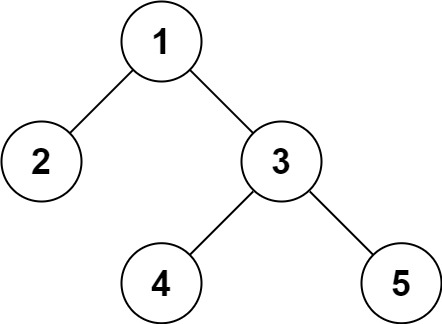

# PROBLEM STATEMENT

Serialization is the process of converting a data structure or object into a sequence of bits so that it can be stored in a file or memory buffer, or transmitted across a network connection link to be reconstructed later in the same or another computer environment.

Design an algorithm to serialize and deserialize a binary tree. There is no restriction on how your serialization/deserialization algorithm should work. You just need to ensure that a binary tree can be serialized to a string and this string can be deserialized to the original tree structure.

# APPROACH

So basically, this is what we have to do -

    Tree -> Serialize -> String -> Deserialize -> Tree

We will be given the root of the Tree and then, if the Serialize function is called on it, we should get a String back. If the Deserialize function is called on this string, it should give us the Tree back.

Now, there can be multiple ways to solve this problem. We can use any traversal technique to traverse the tree and maybe somehow transform the traversal output into string and then take that string, convert it back to the traversal output and then get back the tree.

# LEVEL ORDER TRAVERSAL APPROACH

Let's say that we are given the above tree.

Now, when we Serialize this tree, we have to convert it to a String.

So, we can apply the Level Order Traversal logic and as we traverse each level, we take the value of each node and put it in an output list (as a string)

In this way, at the end, we can join the list by separating values by a comma and return a single string.

For the above tree, we will get this string - 

    "1,2,3,_,_,4,5,_,_,_,_"

Now comes the interesting part. We now have to Deserialize this string and convert it back into the tree that we initially had.

We will use the same logic of a queue data structure that we use in Level Order Traversal, but in reverse.

In Level Order Traversal, we are given a tree and we extract the node values level by level.

Here, we are given values and we have to construct the tree level by level.

To make our code simple, we can convert the string back into a list in the deserialize function.

So, the list becomes - 

        [1,2,3,_,_,4,5,_,_,_,_]

We know that the first value will always be the value of the root node. So, we can create a root node with value 1 and put it in a queue.

Now, we traverse over the nodes in the queue until the queue is empty.

    Initialy, queue = [{1}]

So, we pop the root node from the queue and now, since it is a level order traversal, we know that the left and right child are "2" and "3".

So, the root.left will be a new node with value "2". And similarly, root.right will be a new node with value "3".

And as we did when we created the root node, we will also push them into the queue.

So, queue becomes [{2}, {3}]

Again, the same logic continues in next iteration.

The node in front is {2}. Its left and right child as per the "data" list will be the next two values. That is "null" and "null". In other words, it does not have any nodes on left or right.

The next node is {3}.  Its left and right child as per the "data" list will be the next two values. That is "4" and "5".

And the current iteration ends as well.

So, queue becomes [{4}, {5}]

We pop the front node that is {4}.

Its left and right as per "data" list are next two values. That is "null" and "null". So, it means there are no nodes on left or right of ndoe {4}.

And the same case of {5}.

And finally, the loop ends.

So, we got our tree that we initially had. And that's the whole logic of using Level Order Traversal in this problem.

# PRE ORDER TRAVERSAL APPROACH

This problem can also be solved using Pre Order Traversal or "DFS".

If we have the above tree, and we get the Pre Order traversal of this tree (including the Null nodes), we get - 

    [1,2,_,_,3,4,_,_,5,_,_]

So, in the serialize method, we can return this list by converting it to a string -

    1,2,_,_,3,4,_,_,5,_,_

Now, in the deserialize method, we convert this string back into the list so that we can then get the tree back - 

    [1,2,_,_,3,4,_,_,5,_,_]

So, how do we construct it back?

Well, it is pretty simple. We again follow the Pre Order Traversal approach.

That is, we first get the root node, and then we recursively make calls to build the left subtree and the right subtree. And then we simply attach these trees to the root node and we are done.

The reason why we can create the tree from the Pre Order Traversal is that we also have "Null" nodes in the list so we know when to stop in the recursive calls.

