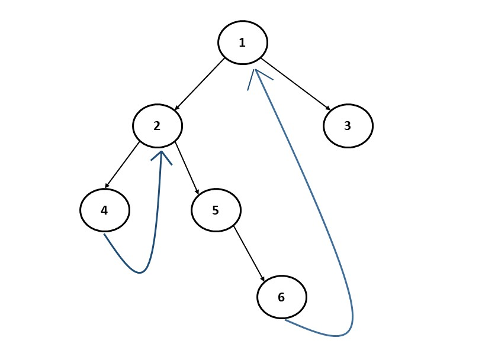

Morris traversal is a tree traversal algorithm that does not employ the use of recursion or a stack. It is a traversal technique that uses the concept of threaded binary tree and helps to traverse any binary tree without recursion and without using stack.

When we traverse a tree using a Stack or Recursion, the space complexity is O(N). But, Morris Traversal has O(1) space complexity.

# IN ORDER TRAVERSAL

When we say In Order Traversal, we mean - "Left -> Root -> Right".

Let's take an example.

For the above Binary Tree, the In Order Traversal will be - 

    [4,2,5,6,1,3]

Now, we need to make some observations here. We see that as soon as we traverse the left subtree, we return back to the root node.

For example, when we traverse the node "4", which is the rightmost node of the left subtree of "2", we return back to 2.

Similarly, for the left subtree of "1", the rightmost node is "6". So from it, we return back to the root node "1".

The issue is, this is a Binary Tree so for any node, we only have information about its left and right child. There is no link between node and its parent.

Now comes the idea of a "Threaded Binary Tree".

We will add threads between rightmost nodes and the parent nodes of the subtree so that we can return back to the parent node once we are done traversing a subtree.

Something like in above example.

So as soon as we are done with left subtree of {2}, we have to return back to 2. So, we add a thread between 4 and 2.

Similarly, as soon as we are done with left subtree of {1}, we have to return back to 1. So we add a thread between 6 and 1.

In figure (i), we see that when we are at node 4 and this red subtree has no right child, we move to the parent of this subtree, i.e node 2. Similarly, in figure(ii), when we are at node 6, this red subtree has no right child, therefore we move to its parent, i.e node 1.

We observe a pattern that whenever we are at the last node of a subtree such that the right child is pointing to none, we move to the parent of this subtree.

And this is one observation that helps us in Morris Traversal.

Ofcourse there can be edge cases as well. So, what are cases can be there?

## CASE #1 - NO LEFT SUBTREE

When the current node has no left subtree. In this scenario, there is nothing to be traversed on the left side, so we simply print the value of the current node and move to the right of the current node.

We did this in the above example when we were at the node {5}. When we are at node 5, we see that there is no left subtree so we print "5" and then move to the right subtree.

## CASE #2 - RIGHT MOST CHILD OF A LEFT SUBTREE IS ALREADY POINTING TO ROOT NODE

When there is a left subtree and the right-most child of this left-subtree is already pointing to the root node. In this case we know that the left subtree is already visited so we need to print the value of the root node and move to the right of the current node.

This case is very important because we also need to remove the links that we had added between the rightmost nodes and the root nodes because it is not a good idea to change the original structure of the given tree.

## SUMMARY

To summarize, at a node whether we have to move left or right is determined whether the node has a left subtree. 

If it doesn’t we move to the right. 

If there is a left subtree then we see its rightmost child. 

If the rightmost child is pointing to NULL, we move the current node to its left. 

If the rightmost child is already pointing towards the current node, we remove that link and move to the right of the current node. 

We will stop the execution when the current points to null and we have traversed the whole tree.

# PRE ORDER TRAVERSAL

Can we use Morris Traversal for Pre Order Traversal?

For the above Binary Tree, the Pre Order Traversal will be - 

    [1,2,4,5,6,3]

If we see, the only difference between Pre Order and Post Order is that in Pre Order, we will print the root nodes before we move towards left subtree. 

On the other hand, in In Order, we first visit the left subtree and then we print the root node.

And because we first print root and then move to the left subtree, it means, we don't want to print the root node when we visit it from the existing thread of the rightmost node of left subtree, something we did in In Order Traversal.

Instead, we want to print it when we see that the rightmost node of left subtree has Null on its right. 

In simple words, in In Order Traversal, this was the code where we check for threads and add or remove them - 

    # If the rightmost node has Null on its right (Which should be the case if there is no Thread already)
    if not temp.right:

        # Add the thread
        temp.right = node

        # Now, move to the left subtree
        node = node.left
                
    # CASE 2 - THREAD ALREADY EXISTS
    # If right child is not null
    # It means, the loop ended because rightmost node has a thread already
    else:

        # So, we have to remove this thread
        temp.right = None

        # Put the root node's value in the inorder list
        inorder.append(node.val)

        # And now we move to the right subree
        node = node.right

But, in Pre Order traversal, before we move to left subtree, we want to print the root node. It means, we need to add the node.val in the list in the "if" block, not in the "else" block in the above code. So, for Pre order, the code becomes - 

    # If the rightmost node has Null on its right (Which should be the case if there is no Thread already)
    if not temp.right:

        # Add the thread
        temp.right = node

        # Put the root node's value in the preorder list  
        preorder.append(node.val) <== THIS ONE CHANGE IS MADE FOR PRE ORDER!

        # Now, move to the left subtree
        node = node.left
                
    # CASE 2 - THREAD ALREADY EXISTS
    # If right child is not null
    # It means, the loop ended because rightmost node has a thread already
    else:

        # So, we have to remove this thread
        temp.right = None

        # And now we move to the right subree
        node = node.right

And just by changing one line, we now have converted the In Order code into Pre Order.

# POST ORDER TRAVERSAL

For the above Binary Tree, the Post Order Traversal will be - 

    [4,6,5,2,3,1]

As we know, Post Order Traversal is Left -> Right -> Root.

Now, what if we reverse it? That is, Root -> Right -> Left

We will get - 

    [1,3,2,5,6,4]

So, if we can find Root -> Right -> Left, we can easily reverse the ouput list to get the Post Order Traversal.

And Root -> Right -> Left sounds pretty similar to the Pre Order traversal which is Root -> Left -> Right.

So it means, we just need to tweak the Pre Order Traversal in such a way that after the Root Node, we traverse the Right subtree first and not the left subtree first. And that's it!

So, this will be the process for Post Order Traversal using Morris Traversal - 

    1. If the right subtree does not exist, print the node and update the node to node.left
    2. If the right subtree exist, check first if the leftmost node in the right subtree has a link to the root node of this subtree or not
    3. If there is no link, then we can add a link between the leftmost node in right subtree and the root of the right subtree and then safely move towards right subtree
    4. If there is already a link, it means we have visited right subtree already so we have to remove the link before we move towards left subtree

And finally, reverse the list that we get after above steps to get the final Post Order Traversal output.
   