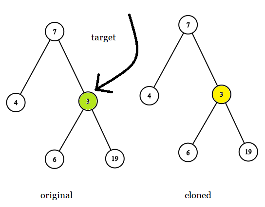

# PROBLEM STATEMENT

Given two binary trees original and cloned and given a reference to a node target in the original tree.

The cloned tree is a copy of the original tree.

Return a reference to the same node in the cloned tree.

Note that you are not allowed to change any of the two trees or the target node and the answer must be a reference to a node in the cloned tree.

# EXAMPLE

Input: tree = [7,4,3,null,null,6,19], target = 3
Output: 3
Explanation: In all examples the original and cloned trees are shown. The target node is a green node from the original tree. The answer is the yellow node from the cloned tree.

# **1. IF THE TREE HAS UNIQUE VALUES**

If the Tree has unique values, like in the problem, then we can simply traverse the cloned tree and find the node that has the same value as target node.

# **2. IF THE TREE HAS DUPLICATE VALUES**

The above approach will fail if the tree has Duplicate values. Because, imagine the example where target node has a value 3, but the cloned tree has two nodes with value 3. Which one to return? 

The correct node should be the one that has the same left and right subtrees as the target node.

It means, if we are at a node "x" in cloned tree where we see that x.val == target.val, we need to also check if the subtree with root "x" is the same as subtree with root "target".

# **3. A BETTER APPROACH IF THE TREE HAS DUPLICATE VALUES**
We are also given the "original" tree and we can use that. See, the "target" node is simply a node that points to a node of "original" tree. It means, if we have to find the "target" node in "original" tree, we do not even have to compare values. We can simply compare two nodes. This is something we cannot do in "cloned" because the "target" node is not a node of "cloned" tree.

And we can use this to our advantage.

If we can traverse the original tree and the cloned tree in the same manner (since both are same), and we found the target node in the origina tree, it means the node at the same location in cloned tree is the one that we have to return. Makes sense?
