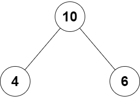

# PROBLEM STATEMENT

You are given the root of a binary tree that consists of exactly 3 nodes: the root, its left child, and its right child.

Return true if the value of the root is equal to the sum of the values of its two children, or false otherwise.

# EXAMPLE

Output = true

# APPROACH

This is a pretty straightforward problem. Since it is given that the input tree will have "exactly" three nodes, it means we can simply write a 1 line solution where we check if root node's value is equal to the sum of children node values.