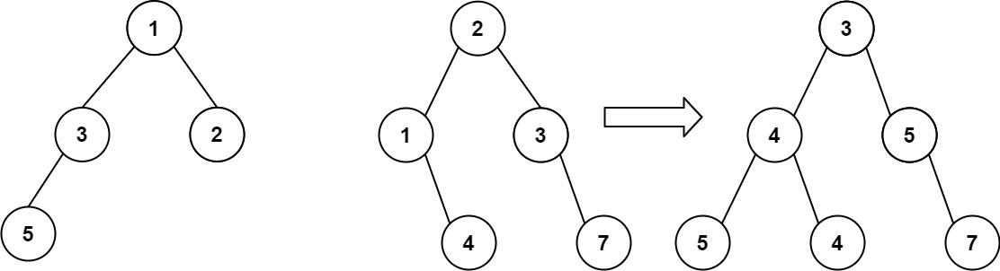

# PROBLEM STATEMENT

You are given two binary trees root1 and root2.

Imagine that when you put one of them to cover the other, some nodes of the two trees are overlapped while the others are not. You need to merge the two trees into a new binary tree. The merge rule is that if two nodes overlap, then sum node values up as the new value of the merged node. Otherwise, the NOT null node will be used as the node of the new tree.

Return the merged tree.

Note: The merging process must start from the root nodes of both trees.

# EXAMPLE

Input: root1 = [1,3,2,5], root2 = [2,1,3,null,4,null,7]
Output: [3,4,5,5,4,null,7]

# APPROACH

The approach is pretty simple. In Recursive solution, our recursive function will merge two trees. So, to merge the input trees, we can sum the root nodes, and them makes recursive calls to merge the left and right subtrees respectively.

At the end, we will have the output tree.

In Iterative Approaches, we will use Stack or Queue, depending on whether it is DFS or BFS. The logic remains the same. We only push to a stack or queue if we know that both the current nodes of the two trees have left and right children. If they don't, we know we can take the one that has the left or right child, and merge it with the other one.