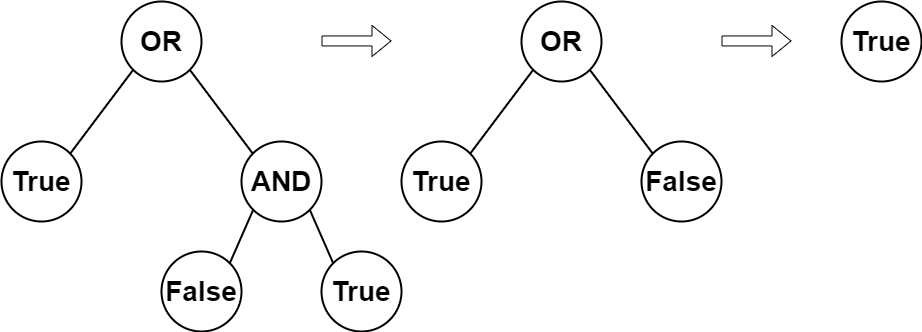
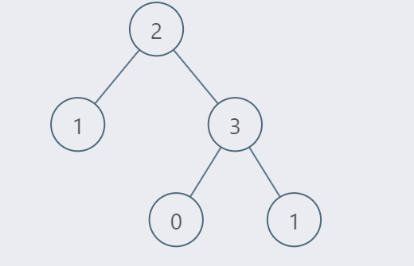

# PROBLEM STATEMENT

You are given the root of a full binary tree with the following properties:

 - Leaf nodes have either the value 0 or 1, where 0 represents False and 1 represents True.
 - Non-leaf nodes have either the value 2 or 3, where 2 represents the boolean OR and 3 represents the boolean AND.

The evaluation of a node is as follows:

 - If the node is a leaf node, the evaluation is the value of the node, i.e. True or False.
 - Otherwise, evaluate the node's two children and apply the boolean operation of its value with the children's evaluations.
Return the boolean result of evaluating the root node.

A full binary tree is a binary tree where each node has either 0 or 2 children.

A leaf node is a node that has zero children.

# EXAMPLE

Input: root = [2,1,3,null,null,0,1]
Output: true

Explanation: The above diagram illustrates the evaluation process.
The AND node evaluates to False AND True = False.
The OR node evaluates to True OR False = True.
The root node evaluates to True, so we return true.

# **1. RECURSIVE SOLUTION**
The recursive solution is very simple.

Let's say we have a function "evaluateTree" that takes the current tree and returns the result after evaluating it. That's it only job.

So, for any tree with root "root", we can use this function to get the result of evaluating the left subtree and the right subtree. Then, we simply need to do the respective operation with the left and right results, depending on the value of the root node.

# **2. ITERATIVE SOLUTION**
The Iterative Solution is a bit tricky. 

We will use a stack to iterate over the tree.

The idea is that, we can override the node values, based on the values in left and right nodes.

In this way, at the end, the root node will have the value as either 1 or 0, indicating True or False.

The tricky part is how to decide when to remove a node and when to push one in the stack.

Suppose, we have above example - 

	root = [2,1,3,null,null,0,1]
	
	So, initially, our stack has the node {2}
	
	Now, we see that this is not the leaf node.
	
	Note that since we have a "FULL" binary tree, there are only two cases.
	
	Either the node is a Leaf Node, or it is a root of some subtree.
	
	If it is root of some tree and it is not a leaf node, 
	it will definitely have two children. Because it is a Full Binary Tree.
	
	So, since {2} is not a LEAF node, it means that we first need to evaluate left and right subtrees.
	If left and right are already leaf nodes, then their values will be 0 or 1.
	
	But here, we see that the left child has value 1 while right child has value 3
	
	It means, while left child is a leaf node, right child is a root node of another subtree.
	
	So, at this point, we cannot evaluate the node {2} because we first need to evaluate the right subtree.
	
	And that's the reason why in the code, we push this node back in case both of its children are not leaf nodes.
	
	And then, we need to push the right child in the stack because it will be evaluated in next iteration.
	
	Now, stack = [2,3]
	
	In next iteration, we have top node as {3}.
	
	We again check if it is a leaf node. No, it is not. 
	
	So, now we check if its left and right children are leaf nodes. 

	YES. Nodes {0} and {1} are leaf nodes.
	
	It means, we can directly evaluate as 0 AND 1 (AND because value is "3")
	
	And so, we get back the result as "0".
	
	And now, we replace the value of node {3} as "0", that is, the result of evaluation of its left and right children.
	
	And now, we won't push it back because we have already evaluated its subtree.
	
	In next iteration, stack will be [2]
	
	And we see that on left of "2", we have a node with value "1".
	
	And on right of tree, the node has value "0". (REMEMBER THAT WE OVERRIDED THE VALUE).
	
	So it means, we can now directly evaluate the node "2" as 
	
	0 OR 1 (OR because value is "2")
	
	So, the root node's value is set to "1"
	
And so, finally, we get the root node's value as 1, which means the result of evaluation is "True".