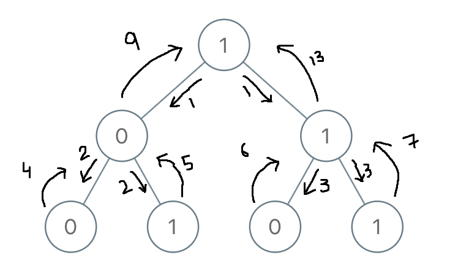

# PROBLEM STATEMENT

You are given the root of a binary tree where each node has a value 0 or 1. Each root-to-leaf path represents a binary number starting with the most significant bit.

 - For example, if the path is 0 -> 1 -> 1 -> 0 -> 1, then this could represent 01101 in binary, which is 13.

For all leaves in the tree, consider the numbers represented by the path from the root to that leaf. Return the sum of these numbers.

The test cases are generated so that the answer fits in a 32-bits integer.

# EXAMPLE

Input: root = [1,0,1,0,1,0,1]
Output: 22
Explanation: (100) + (101) + (110) + (111) = 4 + 5 + 6 + 7 = 22

# **1. BRUTE FORCE APPROACH**
In this approach, we will first get the binary number from the root all the way to the leaf node. And we do this for every path. And once we find one binary number, we then convert it to a decimal and add it to the total sum.

This is definitely not an efficient approach because as we find one binary number, we then have to convert it back into decimal. And this will require extra computation. There is a better way for this conversion as we can do this at the same time when we traverse the nodes.

# **2. EFFICIENT APPROACH**
I was not able to write this solution on my own and had to look at the discussion section. But, once you understand the idea, you'll see how interesting this approach is.

Suppose, we are given the above binary tree.

For the above binary tree, we start with the root node with a value "1". So, at this point, "1" is the least significant bit.

Now, when we move to any of the nodes on left or right, what does it mean?

Let's say we move towards the left child which as a value "0". 

Doesn't it mean that "1" will now be shifted left by one place and then 0 will be added to the end, making "0" the least significant bit now.

Just think about it. If initially, when we were at 1, we converted it to a decimal by doing 2^0 * 1 => 1.

So, when we were at root node, total sum was 1

When we reached left child, binary number became "10" which means the new totalSum becomes (2^1 * 1) + (2^0 * 0) => 2 + 0 => 2

So before reaching this node, total sum was 1, and after reaching this node, total sum is 2

What if we had went towards right child with a value "1". 

In that case, the new binary number would've been "11", resulting in a decimal -> (2^1 * 1) + (2^0 * 1) => 2 + 1 => 3

And these are the only possibilities since we are dealing with 0 or 1 here. 

So it means, if we reached a node with a total sum as "x", then the new total sum when we reach a node will be (2*x) + node.val

And the reason for this "2 * x" is pretty simple. As we go down a level and reach a new node, the value that was at any position earlier, will now be shifted one place on the left. This means, if previously we were converting that value to decimal by doing "2^x + val", we will now have to do "2^(x+1) + val". And that's why at each step when we get a new node, we multiply the total sum we have got till now with "2" and then we add the current node's value to get the new total sum.

At any time, the current node's value will always be the least significant bit of the binary number we have formed so far. Which means ideally for this node's value, we would've done "2^0 * node.val" or simply "node.val". That's why we add it to the total sum as simply "node.val".

So, when we reach the left most leaf node, binary number became 100. So far, total sum is 2.

So now, what will be the new total sum? The current node has a value 0.

As per our general formula, it will be 2 * 2 + 0 => 4

And indeed, the sum from root to leftmost leaf is 4.

And now comes the magic of Recursion into picture. See, when we are at the left child of root node, that is {0}, the left subtree will return us the total sum as "4" which is the binary number "100" converted to decimal.

Now, remember that at node {0}, the total sum is "2".

So when the recursive call is made for its right subtee, it will return sum as "5", which is the binary number "101" converted to decimal.

How we get 5? Well, we do the same thing. That is -

    (2 * totalSum) + node.val
    (2 * 2) + 1
    4 + 1 => 5

And now, at node {0}, left subtree's total sum is 4 and right subtree's total sum is 5. So, what {0} returns back to the root node {1} is the sum of left and right subtrees which is 9. That is, the sum of "100" and "101" after converting them to decimal is "9".

And similarly, the same thing happens for the right subtree of the root node, which gives its total sum as -> 13

And so, for the whole tree, the total sum will be 9 + 13 => 22.

And this is the efficient approach to find the total sum.

# **3. EFFICIENT APPROACH - SHIFT LEFT OPERATOR**
To make it even better to understand, we can replace the "2 * totalSum" by simply "totalSum << 1". 

Here, "<<" is the left shift operator which shifts the bits of the binary representation of a number to the left side by a specified number of places.

For example, at root node, we had total sum as simply "1"

Now, when we moved to left child with value 0, we first used left shift operator on the total sum. That is, "1 << 1", giving us 2. 

And that's how it works.