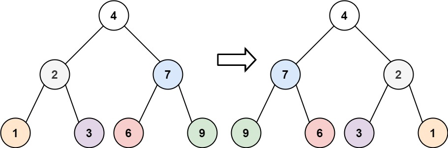

# PROBLEM STATEMENT

Given the root of a binary tree, invert the tree, and return its root.

# EXAMPLE

Input: root = [4,2,7,1,3,6,9]
Output: [4,7,2,9,6,3,1]

# APPROACH

The solution is pretty straighforward. In Recursive approach, our function will take a tree and invert it. So, what we can do is, we can first invert the left subtree, then invert the right subtree, and finally, we point this inverted left subtree as the right subtree of the root, and the inverted right subtree as the left subtree of the root.

In case of Iterative DFS approach, we do the same thing. As we pop a node from the stack, we will not only push its left and right child in the stack, but we will also make its left child as the right, and the rigth child as the left.

And since we do this for each node, at the end, our whole tree will be inverted.

And this same logic can be used for the Iterative BFS Approach.