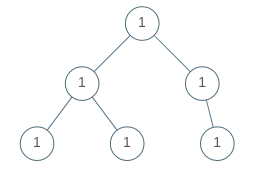

# PROBLEM STATEMENT

A binary tree is uni-valued if every node in the tree has the same value.

Given the root of a binary tree, return true if the given tree is uni-valued, or false otherwise.

# EXAMPLE

Output: true

# APPROACH

The approach is very straightforward. We can use any Tree Traversal technique and we just need to make sure all the nodes in the tree have the same value as the root node of the tree. That's it.