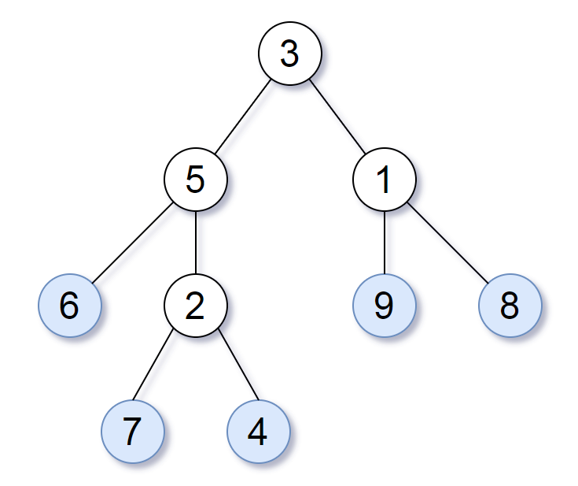
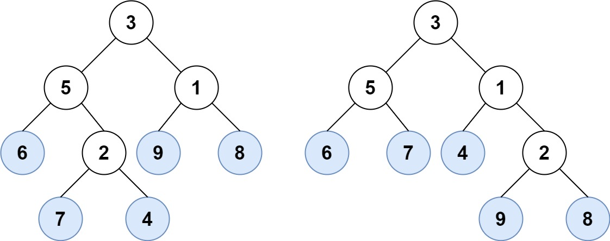

# PROBLEM STATEMENT

Consider all the leaves of a binary tree, from left to right order, the values of those leaves form a leaf value sequence.

For example, in the given tree above, the leaf value sequence is (6, 7, 4, 9, 8).

Two binary trees are considered leaf-similar if their leaf value sequence is the same.

Return true if and only if the two given trees with head nodes root1 and root2 are leaf-similar.

# EXAMPLE

Output -> true

# APPROACH

The idea is to traverse both the trees using DFS Traversal and get the sequence of leaf nodes. In the end, we just need to compare the two sequences to see if the trees are leaf-similar or not.

