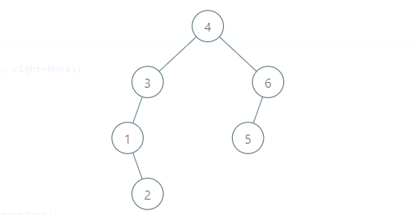

# PROBLEM STATEMENT

Given the root of a binary tree, return all root-to-leaf paths in any order.

A leaf is a node with no children.

# EXAMPLE

Output: ["1->2->5","1->3"]

# **1. RECURSIVE DFS APPROACH**
I think the Recursive DFS Solution is the easiest to write. Basically our "preOrder" function will give us a Boolean that tells us if at current path we have a leaf node or not. If we have, then we can simply take the current path and put it in the final list.

# **2. ITERATIVE DFS APPROACH**
The Iterative DFS solution uses a Stack. 

We start with the root node and in each iteration, we will always push the "right" child first and then the "left" child in the stack. Because remember that we are doing a Pre-Order traversal so in next iteration, we should go to the left side first.

We also have to use another list to keep track of the current path, just how we were doing in case of the Recursive Approach.

And at any point, if the node that we popped from the stack is a leaf node, we can take the current path so far and put it in the output list.

Now comes the part that will take the most amount of time while writing this solution. Now, how do we remove the nodes from the current path that we know won't be of any use in upcoming iterations?

See, if the current node is a leaf node, then obviouslt it won't be of any use in next iterations so we can straight away remove it from current path.

But, what about other nodes before it?

Suppose we have the above Binary Tree as the test case. 

When we are at the node {2}, our currentPath will look like [4,3,1,2] and since "2" is a leaf node, we will remove it from current path so current path will become [4,3,1]. 

But, we can see that we also do not need the nodes {1} and {3} now. So, how to remove them? Well that's pretty simple.

We know that node {2} is the "right" child of {1}. And since we covered {2}, it means we covered both the left and right children of {1} because this is a Pre Order traversal. So, it means {1} is of now use now because both its children have been traversed (let's assume that there were two children).

Now, what about {3}? We see that for {3}, its left child is {1}. But, there is no right child. And since we removed {1}, it means we have already covered the left side of {3} as well so even {3} is of no use now. And so, we remove {3} as well.

And finally, we will have currentPath = [1]. Now we will see that even though {3}, that we just removed, was the left child of {1}, there is still right side of {1} to cover. So, {1} is not removed from the currentPath.

And that's the idea of removing nodes that are no longer required. If one of the following two conditions is true, we will remove the node at the end of the current path -

1. The node we just removed was the right child of node at the end of current path.
2. The node we just removed was the left child of node at the end of current path and the node at the end of current path does not have a right child.

# **3. ITERATIVE BFS APPROACH**
The iterative BFS solution is very simple. Since we will traverse all the nodes in each level from left to right, we can simply keep track of the path from root to each node in a level and when we reach the leaf node, we can simply take that path and push it to the output list.
