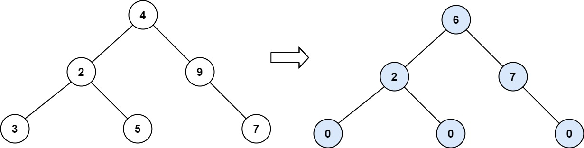

# PROBLEM STATEMENT

Given the root of a binary tree, return the sum of every tree node's tilt.

The tilt of a tree node is the absolute difference between the sum of all left subtree node values and all right subtree node values. If a node does not have a left child, then the sum of the left subtree node values is treated as 0. The rule is similar if the node does not have a right child.

# EXAMPLE

Output: 15

Explanation: 
Tilt of node 3 : |0-0| = 0 (no children)
Tilt of node 5 : |0-0| = 0 (no children)
Tilt of node 7 : |0-0| = 0 (no children)
Tilt of node 2 : |3-5| = 2 (left subtree is just left child, so sum is 3; right subtree is just right child, so sum is 5)
Tilt of node 9 : |0-7| = 7 (no left child, so sum is 0; right subtree is just right child, so sum is 7)
Tilt of node 4 : |(3+5+2)-(9+7)| = |10-16| = 6 (left subtree values are 3, 5, and 2, which sums to 10; right subtree values are 9 and 7, which sums to 16)
Sum of every tilt : 0 + 0 + 0 + 2 + 7 + 6 = 15

# APPROACH

We will define our "dfs" function such that we give it the root of a tree and it gives us the sum of that tree back. So, using this, we can call this function on left and right subtrees so that it gives us the sum of left and right subtrees back. Then, we can update the total tilt sum and return the sum of the tree.

The rest is taken care of recursion.