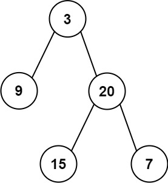

# PROBLEM STATEMENT

Given the root of a binary tree, return the sum of all left leaves.

A leaf is a node with no children. A left leaf is a leaf that is the left child of another node.

# EXAMPLE

Output: 24
Explanation: There are two left leaves in the binary tree, with values 9 and 15 respectively.

# APPROACH

Since we want the sum of only the left leaf nodes, it means we need a way to identify if a leaf node is the left leaf node or right leaf node. And that's very easy. For each node, we can have a flag that tells us that this node is left child or right child. And so, at any time when we find a leaf node, we can also check this flag. And only if this flag is true, we will add the value to the total sum.

And we can use this same idea in both the Recursive, as well as the Iterative solutions.