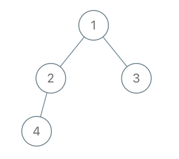

# PROBLEM STATEMENT

Given the root of a binary tree with unique values and the values of two different nodes of the tree x and y, return true if the nodes corresponding to the values x and y in the tree are cousins, or false otherwise.

Two nodes of a binary tree are cousins if they have the same depth with different parents.

Note that in a binary tree, the root node is at the depth 0, and children of each depth k node are at the depth k + 1.

# EXAMPLE

Input: x = 4, y = 3
Output: false

The nodes with values "4" and "3" are not cousins because they are not at the same depth.

# APPROACH

We can simply use the Level Order Traversal or BFS to traverse the tree and at each level, when we go over all the nodes, we will check if the nodes with values "x" and "y" are present in that same level or not. If they are, then it means they might be cousins. It depends on if they have the same parent or not. Because the cousin nodes should not have same parent.
