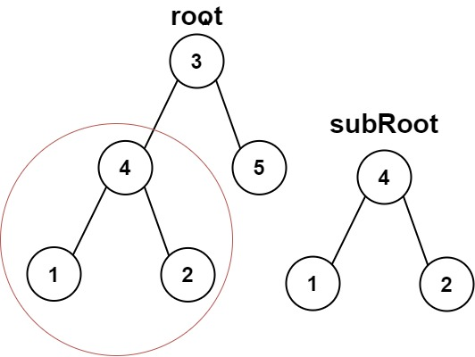

# PROBLEM STATEMENT

Given the roots of two binary trees root and subRoot, return true if there is a subtree of root with the same structure and node values of subRoot and false otherwise.

A subtree of a binary tree tree is a tree that consists of a node in tree and all of this node's descendants. The tree tree could also be considered as a subtree of itself.

# EXAMPLE

Output = True

# **USING THE "SAME TREE" LOGIC**

This problem will be very straightforward if you have done this problem already -> [100. Same Tree](https://leetcode.com/problems/same-tree)

The idea is that as we traverse the trees, at each node, we will check if  "subRoot" is a subtree of "root" or not. And to make this check, we use the same logic as for "Same Tree" problem where we compare two trees to see if they are the same.

# **CHECK IF AN ARRAY IS SUBARRAY OF ANOTHER ARRAY**

Another way to solve this problem is to get the traversals of both the trees and then check if the traversal output of "subRoot" is a subarray of the traversal output of "root".

