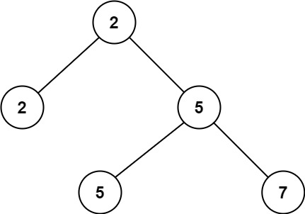

# PROBLEM STATEMENT

Given a non-empty special binary tree consisting of nodes with the non-negative value, where each node in this tree has exactly two or zero sub-node. If the node has two sub-nodes, then this node's value is the smaller value among its two sub-nodes. More formally, the property root.val = min(root.left.val, root.right.val) always holds.

Given such a binary tree, you need to output the second minimum value in the set made of all the nodes' value in the whole tree.

If no such second minimum value exists, output -1 instead.

# EXAMPLE

Output: 5
Explanation: The smallest value is 2, the second smallest value is 5.

# APPROACH

The naive solution uses a sorted set to keep the values in the tree in a sorted order and we maintain the size of this set as 2. So, in the end, we can simply return the second element in this set if the size of set is more than 1. Otherwise, it means there is no second minimum.

A better approach is to simply traverse the tree using DFS or BFS and keep track of the first and second minimum element in the tree. As we traverse the nodes, we update the first and second minimum values accordingly. In the end, we just need to return the second minimum if it is a valid value.

Finally, we have the approach that uses the conditions mentioned in the problem.

As the problem statement says, for any node in a subtree, its value is the minimum among its left and right children. If you think about it, this basically means, in this problem, a valid test case is the one where the root node's value is the smallest in the tree. So, all we need to find is the value that is greater than the root node's value but smaller than all the other values.

And also, let's say we have traversed some part of the tree and so far, we have found that the second minimum is "x". Now, at one node, we see that that node has a value greater than "x". So, should we continue traversing further? It makes no sense. Because, it is given that a node will have a value that is minimum among the left and right children. So, if a node has a value greater than "x", it means none of its children and their children and so on will have a value < x. So, there is no need to traverse further if we are at such point.