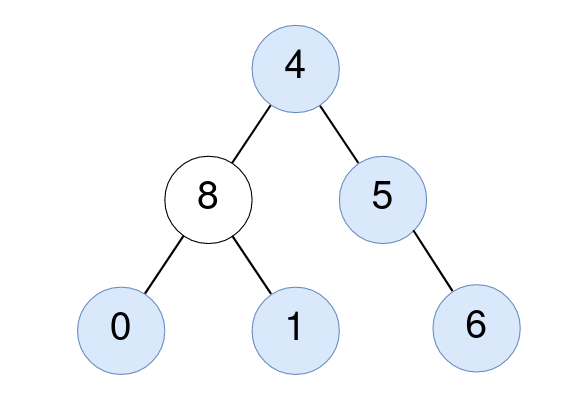

# PROBLEM STATEMENT

Given the root of a binary tree, return the number of nodes where the value of the node is equal to the average of the values in its subtree.

Note:

    - The average of n elements is the sum of the n elements divided by n and rounded down to the nearest integer.
    - A subtree of root is a tree consisting of root and all of its descendants.
  
# EXAMPLE

Output: 5

Explanation: 
For the node with value 4: The average of its subtree is (4 + 8 + 5 + 0 + 1 + 6) / 6 = 24 / 6 = 4.
For the node with value 5: The average of its subtree is (5 + 6) / 2 = 11 / 2 = 5.
For the node with value 0: The average of its subtree is 0 / 1 = 0.
For the node with value 1: The average of its subtree is 1 / 1 = 1.
For the node with value 6: The average of its subtree is 6 / 1 = 6.

# APPROACH

Our helper function "traverse" will traverse the entire tree using Post Order Traversal, and this function returns a pair [sum, count], where "sum" is the sum of all the node values of current subtree and "count" is the number of nodes in the current subtree.

In this way, at each node, we can recursively call this function on left and right subtrees to get the sum and count values so that we can then check the condition that is - 

	(Sum of nodes in left subtree + Root Node's Value + Sum of nodes in right subtree)
						/
	(Count of nodes in left subtree + root node + Count of nodes in right subtree)
	
					==
					
	            root.val
	
And that's the simple Recursive solution!