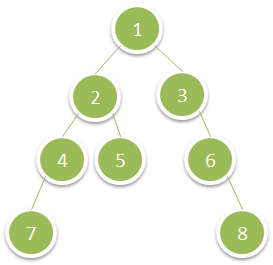

# PROBLEM STATEMENT

Given the root of a binary tree, return the sum of values of its deepest leaves.

# EXAMPLE

Output: 15

# APPROACH

Just iterate the tree level-wise, get the sum of that level, and update the deepest leaves sum.

At the end, we will have the sum of the last level, which is also the sum of deepest leaves.