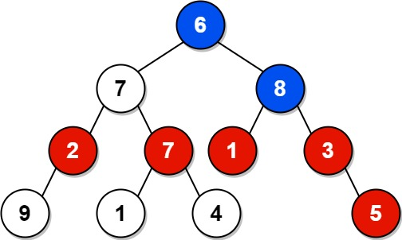

# PROBLEM STATEMENT

Given the root of a binary tree, return the sum of values of nodes with an even-valued grandparent. If there are no nodes with an even-valued grandparent, return 0.

A grandparent of a node is the parent of its parent if it exists.

# EXAMPLE

Output: 18
Explanation: The red nodes are the nodes with even-value grandparent while the blue nodes are the even-value grandparents.

# APPROACH

The idea is pretty simple.

In DFS Approach, we will keep track of the parent and grandparent of each node and so, at each recursive call, we will check if the grandparent exists and if the valeue is even. If it does, we will simply add the node's value to the total sum.

In the BFS approach, we do something similar. In the queue, we push not just the node but also its parent so that at any time, we can check for a node whether its parent's parent is even. If yes, we will add the value to the total Sum.