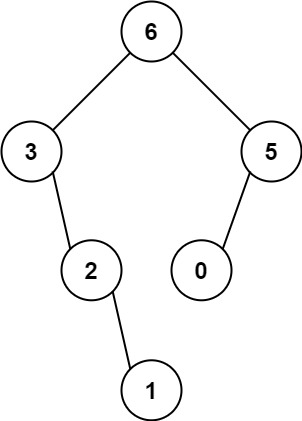

# PROBLEM STATEMENT

You are given an integer array nums with no duplicates. A maximum binary tree can be built recursively from nums using the following algorithm:

    - Create a root node whose value is the maximum value in nums.
    - Recursively build the left subtree on the subarray prefix to the left of the maximum value.
    - Recursively build the right subtree on the subarray suffix to the right of the maximum value.
  
Return the maximum binary tree built from nums.

# EXAMPLE

Input: nums = [3,2,1,6,0,5]
Explanation: The recursive calls are as follow:
- The largest value in [3,2,1,6,0,5] is 6. Left prefix is [3,2,1] and right suffix is [0,5].
    - The largest value in [3,2,1] is 3. Left prefix is [] and right suffix is [2,1].
        - Empty array, so no child.
        - The largest value in [2,1] is 2. Left prefix is [] and right suffix is [1].
            - Empty array, so no child.
            - Only one element, so child is a node with value 1.
    - The largest value in [0,5] is 5. Left prefix is [0] and right suffix is [].
        - Only one element, so child is a node with value 0.
        - Empty array, so no child.

# NAIVE APPROACH

The naive approach will be to find the maximum element in each recursive call out of the available elements in nums, make that the root node, and then recursively build the left and right subtrees.

But, this will be an O(N^2) solution.

# O(N) SOLUTION USING A STACK

We will use a monotonic stack to optimize the solution. We will traverse the list from left to right and for each element, we will check if there exists an element on left side that is greater. If yes, it means, the current element will be the right child of that greater element on left. Because remember that as per the conditions in the problem statement, smaller elements are on the bottom and greater ones are on the top.

In case there is no element greater than current element on the left side, what does it mean? It simply means that the current element is the root node because it is the greatest among all elements in nums that we traversed so far. So, in that case, all the elements on left will become part of the left subtree of this current element.

And finally, we push the node that we create out of current element in the stack.

And as we traverse the entire nums list in this way, at the end, the first element in the stack will be the root node of the final tree that we need to return.