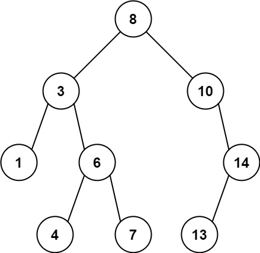

# PROBLEM STATEMENT

Given the root of a binary tree, find the maximum value v for which there exist different nodes a and b where v = |a.val - b.val| and a is an ancestor of b.

A node a is an ancestor of b if either: any child of a is equal to b or any child of a is an ancestor of b.

# EXAMPLE

Output: 7
Explanation: We have various ancestor-node differences, some of which are given below :
|8 - 3| = 5
|3 - 7| = 4
|8 - 1| = 7
|10 - 13| = 3
Among all possible differences, the maximum value of 7 is obtained by |8 - 1| = 7.

# APPROACH

The idea is that, for any node, if we know what was the ancestor with the minimum value so far, and what was the ancestor with the maximum value so far, then we can say that the maximum difference for that node will be the difference between either the node value and the maximum ancestor value, or the node value and the minimum ancestor value.

So, all we need to keep track of is what is the minimum ancestor value and maximum ancestor value so far for any node.