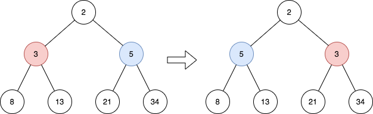

# PROBLEM STATEMENT

Given the root of a perfect binary tree, reverse the node values at each odd level of the tree.

 - For example, suppose the node values at level 3 are [2,1,3,4,7,11,29,18], then it should become [18,29,11,7,4,3,1,2].
  
Return the root of the reversed tree.

A binary tree is perfect if all parent nodes have two children and all leaves are on the same level.

The level of a node is the number of edges along the path between it and the root node.

# EXAMPLE

Explanation: 
The tree has only one odd level.
The nodes at level 1 are 3, 5 respectively, which are reversed and become 5, 3.

# BFS APPROACH

Simple iterate the tree in BFS manner and if a level is odd, we will just reverse the values by swapping them accordingly.

# DFS APPROACH

The DFS approach is pretty interesting. We will traverse the tree in DFS manner and whenever we make a recursive call for left or right node, we also pass a second node. This second node is the one whose value we need to swap with the first node.

For example, ideally in DFS, we make recursive calls as - 

	dfs(root.left)
	dfs(root.right)
	
We just make a small change here and also pass the other node whose value we need to swap with this "root" node.

So, the calls become - 

	dfs(root1.left, root2.right)
	dfs(root1.right, root2.left)
	

For example, if we have the above tree, we will start from level 1. We know the nodes with values "3" and "5" need to be swapped. So, it means the function must be called like this - 

	dfs(node with value 3, node with value 5)
	
Just imagine that we had to reverse all the node values in all levels, not just in odd levels.

In that case, at level 2, we would swap "8" with "34" and "13" with "21"

So, when we are at the node "3", we will make recursive calls like this - 

	dfs(node with value 8, node with value 34)
	dfs(node with value 13, node with value 21)
	
Or in other words

	dfs(left node of {3}, right node of {5})
	dfs(right node of {3}, left node of {5})
	
And that's the whole idea of this DFS approach. Ofcourse we need to reverse only the odd levels and that's why we also need to pass a third value in the function which is the "level".