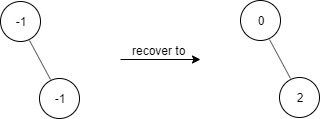

# PROBLEM STATEMENT

Given a binary tree with the following rules:

 - root.val == 0
 - If treeNode.val == x and treeNode.left != null, then treeNode.left.val == 2 * x + 1
 - If treeNode.val == x and treeNode.right != null, then treeNode.right.val == 2 * x + 2

Now the binary tree is contaminated, which means all treeNode.val have been changed to -1.

Implement the FindElements class:

 - FindElements(TreeNode* root) Initializes the object with a contaminated binary tree and recovers it.
 - bool find(int target) Returns true if the target value exists in the recovered binary tree.

# EXAMPLE

Input
["FindElements","find","find"]
[[[-1,null,-1]],[1],[2]]

Output
[null,false,true]
Explanation
FindElements findElements = new FindElements([-1,null,-1]); 
findElements.find(1); // return False 
findElements.find(2); // return True 

# APPROACH

We will iterate the tree using DFS or BFS and keep the node values in a set. Then, whenever we need to check if the target exists in the tree, we can simply check that using the set in O(1) time.