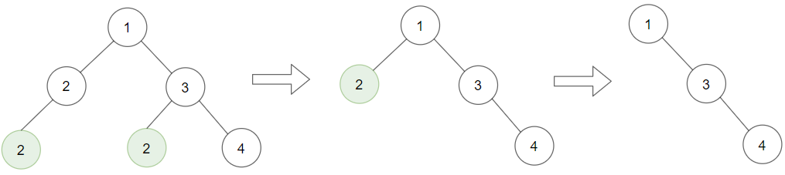

# PROBLEM STATEMENT

Given a binary tree root and an integer target, delete all the leaf nodes with value target.

Note that once you delete a leaf node with value target, if its parent node becomes a leaf node and has the value target, it should also be deleted (you need to continue doing that until you cannot).

# EXAMPLE

Input: root = [1,2,3,2,null,2,4], target = 2
Output: [1,null,3,null,4]
Explanation: Leaf nodes in green with value (target = 2) are removed (Picture in left). 
After removing, new nodes become leaf nodes with value (target = 2) (Picture in center).

# APPROACH

We simply traverse the tree recursively in Post Order Traversal and do the required process. It is all about the magic of Recursion.