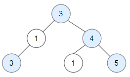

# PROBLEM STATEMENT

Given a binary tree root, a node X in the tree is named good if in the path from root to X there are no nodes with a value greater than X.

Return the number of good nodes in the binary tree.

# EXAMPLE

Input: root = [3,1,4,3,null,1,5]
Output: 4

Explanation: Nodes in blue are good.
Root Node (3) is always a good node.
Node 4 -> (3,4) is the maximum value in the path starting from the root.
Node 5 -> (3,4,5) is the maximum value in the path
Node 3 -> (3,1,3) is the maximum value in the path.

# APPROACH

The idea is to keep track of the maximum node value on the current path from the root. At any time, if the current node has a value >= the maximum value on the current path, then it is a good node.